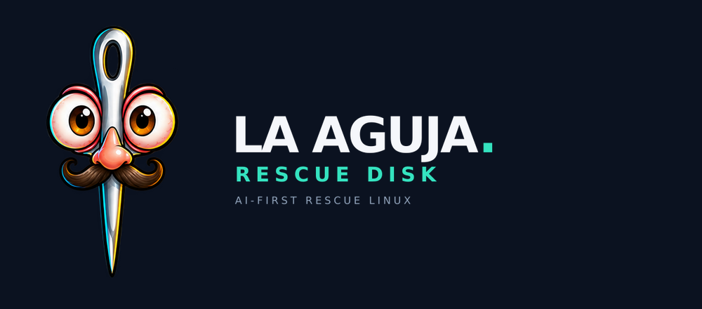

[English](README.md) · **Español**

<p align="center"></p>

<p align="center"><strong>Una entrada pequeña. Control completo.</strong><br>El Linux de rescate en el que el agente IA lleva las herramientas.</p>

**LA AGUJA Rescue Disk** es un entorno live x86-64 para un pendrive: arranca antes del sistema instalado,
conecta Ethernet por DHCP o Wi-Fi guardado/asistido, activa SSH listo para usar y ofrece
**Codex CLI y OpenCode**, preinstalados, e integración opcional con Claude Code y Antigravity, sin escritorio de ventanas.

Estado: **Imager público 0.9.4 · imagen de rescate 0.9.0 · experimental; código abierto**. [Manual de producto con capturas](https://aguja.transcendenceia.net/es/docs) · VALIDATION.md. Una imagen construida no significa compatibilidad de todo el hardware.

## Flash Imager Windows/Linux → tu Rescue Disk → tu tailnet

### También como skill para tu agente

[Flash Imager Agent Skill 1.0.0](https://github.com/Transcendenceia/La-Aguja/releases/download/v0.9.2/aguja-flash-imager-skill-1.0.0.zip) permite pedirle a un agente que prepare una imagen `.img` personalizada con el motor real del Imager, sin Electron. Configura idioma, red, SSH y perfiles opcionales de IA/tailnet; verifica el perfil y los hashes, conserva la base y **no graba un USB automáticamente** ni reconstruye la distro.

[Instalación por arnés](skills/flash-imager/references/harnesses.md): Codex, Claude Code, OpenCode, Gemini CLI, Cursor, OpenClaw y carga manual en otros agentes. Necesita acceso a archivos/terminal y Node 22+. El formato portátil no certifica todos los arneses o sistemas operativos. [ZIP](https://github.com/Transcendenceia/La-Aguja/releases/download/v0.9.2/aguja-flash-imager-skill-1.0.0.zip) · [tar.gz](https://github.com/Transcendenceia/La-Aguja/releases/download/v0.9.2/aguja-flash-imager-skill-1.0.0.tar.gz) · [SHA-256](https://github.com/Transcendenceia/La-Aguja/releases/download/v0.9.2/SHA256SUMS-flash-imager-skill-1.0.0) · [Skill e interfaz JSON](skills/flash-imager/SKILL.md).

### Aplicación de escritorio

[Aplicación y descargas](https://aguja.transcendenceia.net/) · [Guía Windows/Linux](desktop/README.md).

Prepara idioma/teclado, Ethernet/Wi-Fi, SSH y herramientas IA. **Preparar y grabar USB** crea una imagen privada nueva automáticamente, verifica identidad/capacidad del USB y exige confirmación nativa antes de escribir. Linux ofrece respaldo opcional; **Windows todavía no implementa respaldo USB integrado**, por lo que debe hacerse externamente antes. La verificación de lectura no prueba arranque universal.

El acceso remoto nuevo usa **Tailscale o Headscale propios**. Habilita la opción, pega una auth/pre-auth key, URL HTTPS Headscale opcional (vacío: Tailscale oficial) y nombre de nodo opcional. El live se inscribe al arrancar con red y perfil desbloqueado; el Imager no inscribe tu PC ni prepara un túnel propietario. OpenSSH normal por tailnet es predeterminado; Tailscale SSH es avanzado y exige políticas SSH compatibles. El cliente debe estar en la misma tailnet autorizada.

La identidad vive en RAM: cada reinicio necesita reinscripción, una clave de un uso no garantiza repetir. Usa una reutilizable, vigente y limitada cuando necesites varios arranques, y retira nodos/claves al terminar. Cifra la cápsula del USB; esto no cifra todo AGUJA_DATA ni protege secretos frente a root después del desbloqueo. Las imágenes antiguas sin `tailscale-profile-v1` se rechazan antes de prepararse con esta opción.

No hay cuenta de LA AGUJA: las imágenes son públicas en nuestra web y el Imager y el código están en GitHub. Las cuentas IA y la administración de la tailnet son independientes.

**Mini navegador OAuth local:** `aguja login codex|claude|antigravity` conserva el callback oficial y la misma PTY mientras muestra Chromium normal con sandbox. Si copias un código, toma foco la consola y tú pegas explícitamente con Ctrl+Shift+V. Cerrar devuelve al terminal original. OpenCode usa su login nativo; SSH/serie/sin pantalla conserva URL/método nativo. El nuevo recorrido no usa QR y no autoriza cuentas de IA automáticamente.

API e importación selectiva de sesiones nativas portables continúan; no se copia todo el llavero, historial, hooks ni MCP del PC. Un archivo portable no prueba vigencia. Costes, cuotas y datos enviados dependen del proveedor. El usuario `aguja` dispone de sudo/root completo; una instrucción de «solo lectura» no es un sandbox.

Los informes de versiones previas se conservan en [docs/](docs/) como evidencia histórica, no como descripción del nuevo recorrido.

## Dos maneras de rescatar

1. **Desde otro equipo:** arranca LA AGUJA Rescue Disk, conecta por `ssh aguja@IP`, usa `sudo -n bash`
   o inicia un arnés con `aguja agent codex`. No requiere OpenClaw en el USB.
2. **Desde la consola del equipo averiado:** elige un agente en el cockpit de texto,
   autentica tu proveedor y trabaja sobre el hardware directamente.

**Full power predeterminado:** la cuenta `aguja` dispone de `sudo` ilimitado. El launcher
desactiva las aprobaciones/sandbox de los arneses mediante sus mecanismos disponibles.
`agent_mode=ask` conserva las aprobaciones propias del arnés sin quitarte acceso root.
No hay reparación, instalación ni escritura sobre discos internos al arrancar.

## Login oficial en el propio disco

Desde consola local, `aguja login codex|claude|antigravity` puede abrir el navegador
mínimo con el dominio oficial y una consola unida a la misma PTY. Copiar solo cambia
el foco; tú pegas con Ctrl+Shift+V. No usa QR ni sustituye el callback o consentimiento
del proveedor. OpenCode conserva `opencode auth login` nativo. En SSH/serie no se
promete el mismo recorrido gráfico ni un callbacklocalhost reenviado automáticamente.

## Configurar el USB

**Listo al arrancar:** consola con autologin, usuario SSH `aguja`, contraseña pública de
fábrica `aguja`, bienvenida con IP actual y hostname `.local`. Wi-Fi guardado se activa;
sin red, el panel abre un selector interactivo y permite trabajar offline.
`aguja password` configura una contraseña personalizada y la guarda en el USB.

Abre la partición **AGUJA_CFG** desde Linux/Windows/macOS y edita `aguja.conf`:

```ini
[aguja]
hostname = aguja
wifi_ssid = MiRed
wifi_password = MiClaveWifi
wifi_security = wpa-psk
wifi_country = ES
wifi_hidden = no
ssh_password = aguja
ssh_public_key =
ssh_port = 22
persistent_home = no
default_harness = menu
agent_mode = full
```

Valores **literales, sin comillas**. No se ejecutan como shell. CRLF y UTF-8 BOM funcionan.
Los espacios iniciales/finales se recortan; no se admiten valores multilínea.
La imagen pública no trae **credenciales personales**, claves privadas/públicas personales ni tokens.
La contraseña de fábrica `aguja` es pública por diseño. Una personalizada prevalece;
un valor vacío sin clave pública mantiene el acceso de fábrica (compatible con USBs anteriores).
Un valor vacío **con** clave pública permite solo esa clave. `sudo passwd aguja` cambia la
contraseña de la sesión; `aguja password` también la conserva para próximos arranques.

Las credenciales del archivo son texto plano por diseño: cualquiera con acceso físico al USB
puede leerlas. Puedes usar solo `ssh_public_key` y dejar `ssh_password` vacío.
Las conexiones Wi-Fi empresariales/portal cautivo requieren configurar NetworkManager manualmente.

## Cockpit

Panel a pantalla completa con Agujita animada, IP que se actualiza al conectar y comando SSH
listo para copiar. La vista gráfica dibuja directamente sobre el framebuffer, sin escritorio
ni navegador; si el hardware no lo permite, mantiene una consola de texto adaptable.
`aguja.local` y el servicio `_ssh._tcp` se anuncian con Avahi en la LAN;
el panel muestra el nombre real anunciado si hay colisión. mDNS requiere soporte en el
controlador y multicast en la LAN: la IP sigue siendo la alternativa.

Zsh está preconfigurada con Tab, menú de completado, sugerencias de historial y resaltado;
no necesita Oh My Zsh, fuentes especiales ni descargas al arrancar. Flechas/números controlan
el panel. El login SSH interactivo muestra un resumen y el comando para leer la guía del agente.

Desde 0.3.1, el panel presenta tareas seleccionables (↑↓/Enter), filtros por sesión,
fallos y sondeos (S/F/B), detalle con salida filtrada y retorno al directo (L).
`aguja run --label "Título" -- comando` da contexto al trabajo remoto.
Los sondeos Git sobre carpetas sin repositorio se agrupan sin cambiar sus códigos;
los errores reales siguen visibles. [Uso y privacidad](docs/ACTIVITY.md).

Desde 0.3.0, la pantalla anuncia las conexiones SSH autenticadas y muestra sesiones,
comandos y procesos descendientes en vivo, con salida de diagnósticos permitidos. Los datos
son una vista acotada en RAM, no una transcripción persistente. Las entradas de teclado no
se registran; los argumentos y scripts en la línea de comandos son visibles y desplegables,
con valores de credenciales enmascarados. Scripts recibidos por stdin y transferencias conservan
su funcionamiento pero no exponen sus contenidos en la pantalla. Consulta
[ACTIVITY.md](docs/ACTIVITY.md) para alcance y límites comprobados.

```sh
aguja                  # panel interactivo
aguja status           # IP, discos, conexión SSH y huella pública
aguja status --json    # estado sin secretos para un agente remoto
aguja status --disks   # añadir inventario de discos
aguja activity --json  # sesiones, eventos y procesos SSH; estado temporal sin secretos
aguja wifi             # seleccionar red y guardarla en el USB
aguja password         # contraseña SSH personalizada y persistente
aguja help             # instrucciones de uso
aguja tools            # inventario por categorías
aguja context          # guía completa para quien entra por SSH
aguja doctor           # comprobar configuración y componentes sin mostrar secretos
aguja agent codex      # también antigravity | claude | opencode
sudo -n bash           # root real, sin contraseña
aguja mount-ro /dev/nvme0n1p2 /mnt/target
aguja config           # editar el archivo del USB; reinicia para reaplicarlo
```

Los agentes arrancan como usuario normal con root disponible a través de sudo: esto evita
la incompatibilidad de Claude Code con su modo sin permisos ejecutado directamente como root.
Las sesiones IA necesitan Internet, una cuenta compatible y tu propia autenticación.
No se promete una inferencia local/offline; las herramientas tradicionales sí funcionan offline.

## Qué lleva

| Capa | Herramientas |
|---|---|
| Base | Debian 13 mínimo, kernel amd64, live-boot, glibc, systemd; sin GUI |
| Red | NetworkManager/nmtui, Ethernet DHCP, Wi-Fi WPA2/WPA3, SSH, Avahi/mDNS |
| IA | Codex, Google `agy`, Claude Code, OpenCode; versiones fijadas |
| Recuperación | GNU ddrescue, TestDisk/PhotoRec, rsync |
| Hardware | smartctl, nvme-cli, hdparm, lshw, pciutils, usbutils |
| Sistemas de archivos | ext4, Btrfs, XFS, NTFS, exFAT, FAT |
| Volúmenes | LUKS, LVM, mdadm, Dislocker (requiere clave BitLocker) |
| Instalación | debootstrap, arch-install-scripts, GRUB BIOS/UEFI, efibootmgr, wimlib |
| Operación | Zsh + completado/sugerencias/colores, tmux, Python, curl, git, jq, ripgrep, nano |

Firmware incluido para Intel, Realtek, Atheros, Broadcom y MediaTek. Eso amplía la compatibilidad,
no garantiza todo chip Wi-Fi ni drivers propietarios. El tamaño real está en la validación.
El núcleo es mínimo; cuatro agentes y firmware hacen imposible una imagen de unas pocas decenas de MB.
Los arneses se empaquetan como binarios nativos: Node/npm se usan solo durante la construcción,
no se arrastran sus cachés ni todas las variantes de arquitectura al USB.

## Almacenamiento y arranque

- Imagen híbrida BIOS + UEFI x86-64. **No se ofrece una cadena Secure Boot firmada universal**.
- Raíz squashfs de solo lectura + overlay en RAM: no altera el OS instalado.
- **AGUJA_CFG**: FAT32 visible, `aguja.conf` editable desde otro sistema.
- **AGUJA_DATA**: ext4; workspace y host key SSH propia del USB.
- `persistent_home=no`: HOME y tokens desaparecen al reiniciar.
- `persistent_home=yes`: HOME/tokens se guardan en el USB **sin cifrar**.
- La partición de datos se asocia al mismo disco del medio live, no a un disco interno con una etiqueta parecida.

## Construir y preparar

En un host Debian 13 amd64 con sudo, al menos 15 GB libres y acceso a Internet:

```sh
sudo apt-get install debootstrap squashfs-tools grub-pc-bin grub-efi-amd64-bin xorriso mtools dosfstools gdisk jq fonts-dejavu-core ffmpeg nodejs npm
npm ci
npm run branding
sudo bash scripts/build-rootfs.sh
sudo bash scripts/build-image.sh
python3 -m unittest discover -s tests -v
```

Se generan `dist/aguja-<VERSION>-amd64.iso`, `.img`, inventario de paquetes y `SHA256SUMS`.
La ISO es útil para VMs; la **IMG** añade particiones configurables al USB.
Usa [la guía de grabación](docs/USB.md) y nunca adivines `/dev/sdX`.

## Agujita · nuestra mascota

<p align="center"></p>

La aguja de metal, los ojos ámbar y el bigote rizado son la identidad del producto.
**LA AGUJA Rescue Disk** es la marca; **Agujita** es el personaje. Ocho expresiones, un bucle de
96 fotogramas a 12 fps, iconos con transparencia y portada para la presentación.
GRUB muestra la marca estática; Plymouth anima la mascota durante el arranque,
sin instalar un escritorio. Diagnóstico y `nomodeset` conservan el arranque en texto.

- [Vista interactiva local: marca, splash y expresiones](branding/preview/index.html)
- Guía de identidad y recursos

Los identificadores técnicos (`aguja`, `aguja.conf`, etiquetas `AGUJA_*` y nombres
de imagen) se conservan para compatibilidad; el nombre visible es **LA AGUJA Rescue Disk**.

## Documentación

Empieza en el [manual de usuarios con 26 apartados y capturas](https://aguja.transcendenceia.net/es/docs):
[primer USB](https://aguja.transcendenceia.net/es/docs#primer-usb),
[glosario](https://aguja.transcendenceia.net/es/docs#glosario),
[IA paso a paso](https://aguja.transcendenceia.net/es/docs#ia-preparacion),
[diez ejemplos de uso](https://aguja.transcendenceia.net/es/docs#casos) y
[ruta profesional](https://aguja.transcendenceia.net/es/docs#profesional).
Puedes imprimir/guardar PDF desde la guía. [Copia del manual](docs/USER-GUIDE.md) ·
[Índice de documentos actuales e históricos](docs/README.md).


- Arquitectura y decisiones
- [Guía instalada de consola](runtime/QUICKSTART.md)
- [Instrucciones instaladas para el agente SSH](runtime/AGENT-CONTEXT.md)
- [USB, copia y rollback](docs/USB.md)
- [Rescate y acceso remoto](docs/RESCUE.md)
- [Instalar sistemas operativos](docs/INSTALL.md)
- [Arneses y autenticación](docs/HARNESSES.md)
- Pruebas y límites
- Roadmap
- Licencias y publicación

## Idiomas

El idioma principal del repositorio es inglés y el secundario español. La web y las guías operativas de 26 apartados están disponibles en inglés, español, francés, alemán, portugués, italiano, neerlandés y chino simplificado. [Índice multilingüe](docs/README.md). El manual español ampliado se conserva íntegro; los documentos técnicos históricos mantienen su idioma y versión.

## Código abierto y desarrollo

GPL-3.0-or-later para el código y recursos propios; véase [LICENSE](LICENSE) y [NOTICE.md](NOTICE.md) para las licencias externas y concesiones MIT anteriores. [Contribuir](CONTRIBUTING.md) · [Seguridad](SECURITY.md) · [Publicación reproducible](docs/PUBLISHING.md).

```sh
python3 -m venv .venv
.venv/bin/pip install -r requirements-dev.txt
.venv/bin/python -m unittest discover -s tests
cd desktop
npm ci
npm test
```

La web no ejecuta terminales remotos ni almacena cuentas. Las imágenes y el catálogo firmado se sirven desde la web oficial; el Imager y las fuentes están en GitHub Releases; el catálogo conserva firma Ed25519 y cada imagen se verifica antes de prepararse.
