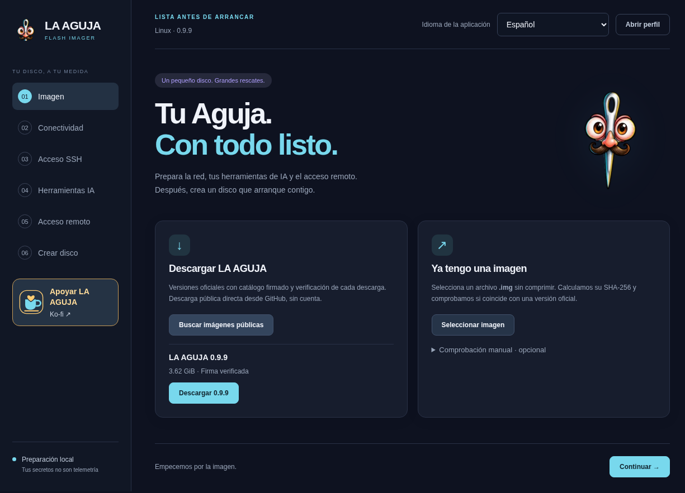
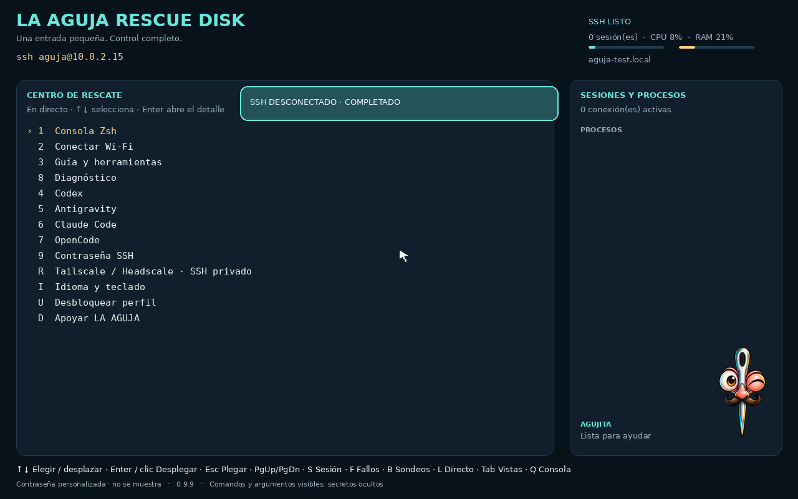
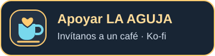

<p align="center"></p>

<p align="center"><strong>Una pequeña entrada. Grandes posibilidades.</strong><br>Un taller Linux arrancable para construir, configurar, experimentar y recuperar.</p>

<p align="center"><a href="https://aguja.transcendenceia.net/es">Descargar</a> · <a href="docs/GETTING-STARTED.es.md">Primeros pasos</a> · <a href="docs/PLATFORM.es.md">Explorar misiones</a> · <a href="docs/README.es.md">Documentación</a> · <a href="README.md">English</a></p>

**Flash Imager 0.9.9 · Rescue Disk 0.9.9 · Experimental · x86-64**

El inglés es el idioma principal del repositorio y el español, el secundario. La web y las guías operativas siguen disponibles en **ocho idiomas**.

**Tu equipo no necesita un sistema instalado para empezar su próximo proyecto.** LA AGUJA arranca desde USB un Linux independiente, incluso con el disco vacío. Lleva **Codex CLI, OpenCode, Claude Code y Antigravity**, herramientas Linux con acceso root y SSH opcional al hardware: instala y configura sistemas, prepara servidores, compila software, amplía la sesión a un laboratorio virtual, migra almacenamiento o recupera datos. Rescatar es una misión, no todo el producto.

**Tu PC operativo → Flash Imager → tu USB live → la máquina donde quieres construir.**

El live usa una **capa de escritura en RAM sobre una imagen USB de solo lectura**; no copia todo el USB a RAM ni ejecuta IA en firmware. No cambia discos internos automáticamente al inicio. Guarda resultados útiles en el almacenamiento elegido: la RAM es temporal, pero escribir deliberadamente en discos sí persiste. La IA en nube necesita red y tu cuenta; las herramientas tradicionales pueden trabajar sin Internet. [Explora veinte misiones para Linux y Windows](docs/PLATFORM.es.md).

Sin cuenta de LA AGUJA, relay propietario ni terminal alojado. La IA en nube sí requiere Internet, cuenta compatible propia y cuota disponible. Las licencias y condiciones externas siguen siendo independientes: [NOTICE](NOTICE.es.md).

> **Control real, responsabilidad real.** La cuenta `aguja` tiene sudo/root ilimitado. El modo Seguro pide confirmación de tareas; **no es un sandbox**. Arrancar no monta, repara, instala ni escribe automáticamente en discos internos. Identifica origen y destino, conserva una copia y autoriza los cambios antes de realizarlos.

## Mira el producto real



*Captura real del Imager Linux 0.9.9 empaquetado, en español. No demuestra autenticación de cuentas ni grabación de un USB físico.*



*Captura real de Rescue 0.9.9 en una VM QA con datos sintéticos, en español. El hostname y la IP NAT de QEMU son datos de prueba, no una dirección a la que conectarte. Ver el panel no demuestra un rescate terminado.*

[Ocho capturas reales, contexto y límites](docs/SCREENSHOTS.es.md). Las capturas con inglés seleccionado conservan algunas etiquetas españolas de la versión real.

## Elige tu primera misión

| Quieres… | Empieza por… | Con qué deberías terminar |
| --- | --- | --- |
| Instalar y configurar Linux en un SSD vacío | [Constructor de sistemas](docs/PLATFORM.es.md#1-de-ssd-vacío-a-linux-configurado) | Sistema configurado y primer arranque verificado |
| Ejecutar invitados sin instalar el anfitrión | [Datacenter de bolsillo](docs/PLATFORM.es.md#2-datacenter-de-bolsillo-sin-instalar-el-anfitrión) | Laboratorio con recursos acotados, QEMU añadido e imágenes guardadas |
| Usar un PC disponible para una demo LAN o taller | [Servicios pop-up](docs/PLATFORM.es.md#3-taller-lan-o-estación-de-demos-pop-up) | Servicio temporal probado y cierre limpio |
| Compilar fuera del entorno del disco | [Fábrica de software](docs/PLATFORM.es.md#4-fábrica-de-software-independiente-del-disco) | Scripts reproducibles, pruebas y artefactos exportados |
| Preparar un NAS o servidor de aplicaciones | [Inicio bare-metal](docs/PLATFORM.es.md#5-preparar-un-nas-o-servidor-de-aplicaciones-desde-bare-metal) | Servicios instalados comprobados desde cliente autorizado |
| Migrar almacenamiento o probar otra configuración | [Migraciones y experimentos](docs/PLATFORM.es.md#6-taller-de-migraciones-fuera-de-ambos-sistemas) | Datos verificados, reversión y recetas repetibles |
| Preparar y desplegar Windows | [Despliegue Windows](docs/PLATFORM.es.md#16-preparar-y-desplegar-una-instalación-oficial-windows) | Kit oficial y arranque Windows nativo verificado |
| Configurar o probar Windows para otro rol | [Kit y laboratorio Windows](docs/PLATFORM.es.md#17-kit-repetible-para-el-rol-de-tu-windows) | Archivos revisados o invitados aislados, con validación nativa |
| Diagnosticar o recuperar el sistema existente | [Procedimientos de rescate](docs/SHOWCASE.es.md) | Resultados observables y respaldos conservados |

Son **ideas de trabajo y plantillas de prompts**, no testimonios ni casos de éxito inventados. Cada ejemplo incluye herramientas, entregables esperados y condiciones de parada.

Más allá: migración físico→virtual, laboratorio PXE, imágenes Linux propias, inferencia local opcional, cómputo científico, recolección edge y coordinación de hosts. Un agente avanzado trabaja desde el objetivo y la evidencia viva, no desde un menú cerrado de reparaciones. Consulta las [veinte misiones](docs/PLATFORM.es.md).

## Primeros pasos

1. **Prepara desde un PC Windows o Linux operativo.** [Descarga Flash Imager](https://github.com/Transcendenceia/La-Aguja/releases/tag/v0.9.9). El EXE/AppImage es el preparador, no la imagen de rescate.
2. **Selecciona la imagen.** Usa el catálogo firmado o descomprime el `.img.zst` descargado manualmente antes de elegir el `.img`. La ISO sirve para pruebas de arranque en VM.
3. **Configura idioma, teclado, red y SSH.** Sustituye la contraseña SSH pública de fábrica `aguja` por una propia o una clave pública. IA y tailnet son opcionales.
4. **Protege el perfil.** Cifra la cápsula si contiene secretos. Cambia la frase inicial pública `aguja` y guarda la nueva fuera del USB. Esto no cifra HOME persistente ni todo AGUJA_DATA.
5. **Respalda y graba el USB exacto.** Compara modelo, serie y capacidad real. Windows necesita respaldo USB externo; Linux ofrece copia completa verificada opcional. Espera la verificación íntegra de lectura.
6. **Arranca e inspecciona.** Desbloquea localmente si corresponde, comprueba el live e identifica cada disco antes de plantear cambios.

```sh
aguja profile unlock   # solo si el perfil está cifrado
aguja status
aguja doctor
lsblk -o NAME,SIZE,MODEL,SERIAL,FSTYPE,LABEL,MOUNTPOINTS
```

[Guía detallada del primer arranque](docs/GETTING-STARTED.es.md) · [Solución de problemas](docs/TROUBLESHOOTING.es.md)

### Deja que un agente prepare la imagen

**Flash Imager Agent Skill 1.0.1** empaqueta el motor real de preparación de imágenes sin Electron. Un agente con acceso a archivos/terminal y **Node.js 22+** puede configurar idioma, red, SSH y perfiles opcionales IA/tailnet, verificar perfil y hashes y conservar intacta la imagen base. **No** graba automáticamente un USB ni reconstruye la distribución.

[ZIP](https://github.com/Transcendenceia/La-Aguja/releases/download/v0.9.9/aguja-flash-imager-skill-1.0.1.zip) · [tar.gz](https://github.com/Transcendenceia/La-Aguja/releases/download/v0.9.9/aguja-flash-imager-skill-1.0.1.tar.gz) · [SHA-256](https://github.com/Transcendenceia/La-Aguja/releases/download/v0.9.9/SHA256SUMS-flash-imager-skill-1.0.1) · [Instalación por arnés](skills/flash-imager/references/harnesses.md)

Hay instrucciones para Codex, Claude Code, OpenCode, Gemini CLI, Cursor, OpenClaw y carga manual. Un formato portátil no certifica todos los arneses o sistemas operativos.

## Un taller, no una promesa de un clic

| Área | Capacidades incluidas |
| --- | --- |
| Base live | Debian 13 amd64, recorridos BIOS/UEFI, squashfs de solo lectura + overlay RAM; sin escritorio convencional |
| Recuperación | GNU ddrescue, TestDisk/PhotoRec, rsync |
| Hardware | smartctl, nvme-cli, hdparm, lshw, inventario PCI/USB |
| Almacenamiento | ext4, Btrfs, XFS, NTFS, exFAT, FAT; herramientas LUKS, LVM, RAID y BitLocker con la clave correcta |
| Conectividad | NetworkManager, Ethernet/Wi-Fi, OpenSSH, Avahi/mDNS, tailnet propia opcional |
| Clientes IA | Codex CLI, OpenCode, Claude Code, Antigravity; instalados independientemente de preparar credenciales |
| Operación | Zsh, tmux, Python, curl, git, jq, ripgrep, nano |
| Construcción de sistemas | debootstrap, arch-install-scripts, herramientas de particionado/archivos y GRUB |

**Amplía según tu misión:** puedes añadir QEMU/KVM, motores de contenedores, compiladores y SDK si son compatibles con kernel live, hardware y recursos. No se prometen incluidos ni como funciones de un clic. La plataforma aporta Linux independiente y agentes capaces, no un hipervisor integrado, modelo IA local ni orquestador automático de equipos. [Requisitos, prompts y entregas](docs/PLATFORM.es.md).

**Nuevo en 0.9.9:** historial de consola local con rueda, hasta 10.000 líneas en RAM sin transcripciones guardadas; baja hasta el prompt o pulsa Esc para volver. SSH conserva el comportamiento del terminal cliente. Imager comprueba espacio antes de copiar una imagen privada; Windows permite elegir otra carpeta de trabajo. [Notas de versión](docs/RELEASE-0.9.9.md).

### Consola local o SSH

Conecta con `ssh aguja@IP` usando la dirección real del live y verificando su huella. Tailscale/Headscale opcional registra el live tras arrancar, disponer de red y desbloquear el perfil, no el PC preparador. OpenSSH por tailnet es el valor predeterminado; Tailscale SSH es una opción avanzada distinta que necesita políticas compatibles.

La identidad tailnet vive **solo en RAM** y se registra de nuevo tras reiniciar. Una clave de un uso puede no servir dos veces. Para varios arranques usa claves reutilizables vigentes y limitadas bajo tu administración; retira después nodos y claves obsoletos. ACL y control plane determinan el acceso.

### Entra en tu proveedor IA

Localmente, `aguja login codex`, `aguja login claude` o `aguja login antigravity` pueden abrir Chromium con sandbox en el login oficial y con la PTY original. Copiar enfoca la consola; pega expresamente con Ctrl+Shift+V. OpenCode usa `opencode auth login`. Sin consentimiento automático y sin QR en este recorrido.

SSH/serie/sin pantalla conservan métodos nativos; no se reenvía automáticamente un callback localhost remoto. Las claves API y la importación selectiva de sesiones portables son alternativas, no pruebas de autenticación vigente. No se copia todo el llavero, historial, hooks ni configuración MCP. Costes, cuotas y datos enviados dependen de tu cuenta y proveedor.

### Qué se conserva

| Ubicación u opción | Comportamiento |
| --- | --- |
| AGUJA_CFG | Configuración FAT32, incluido `aguja.conf` editable; valores en texto plano legibles desde el USB |
| AGUJA_DATA | Workspace ext4 y host key SSH propia del USB; la cápsula no cifra toda la partición |
| `persistent_home=no` | HOME y tokens de sesión desaparecen al reiniciar |
| `persistent_home=yes` | HOME y tokens persisten **sin cifrar** en el USB |
| Cápsula cifrada | Protege el perfil bloqueado, no secretos cargados frente a root |

Las imágenes privadas y plantillas `.aguja` pueden contener credenciales. No las publiques. `aguja password` conserva un cambio de contraseña SSH; `sudo passwd aguja` solo cambia la sesión. Contraseña vacía **con** clave pública permite solo clave; **sin** clave mantiene el acceso público de fábrica.

El perfil cifrado fuerza `persistent_home=no` al arrancar; HOME persistente sin cifrar corresponde a configuraciones antiguas/en texto plano.

## Documentación e idiomas

| Siguiente lectura | English | Español |
| --- | --- | --- |
| Preparar y arrancar | [Getting started](docs/GETTING-STARTED.md) | [Primeros pasos](docs/GETTING-STARTED.es.md) |
| Construir, configurar y experimentar | [Platform missions](docs/PLATFORM.md) | [Misiones de la plataforma](docs/PLATFORM.es.md) |
| Prompts, herramientas y entregables | [Showcase](docs/SHOWCASE.md) | [Ejemplos](docs/SHOWCASE.es.md) |
| Diagnóstico por capas | [Troubleshooting](docs/TROUBLESHOOTING.md) | [Solución de problemas](docs/TROUBLESHOOTING.es.md) |
| Capturas reales | [Gallery](docs/SCREENSHOTS.md) | [Galería](docs/SCREENSHOTS.es.md) |
| Referencias e historial | [Documentation index](docs/README.md) | [Índice](docs/README.es.md) |

Web y guías operativas: [English](https://aguja.transcendenceia.net/en/docs) · [Español](https://aguja.transcendenceia.net/es/docs) · [Français](https://aguja.transcendenceia.net/fr/docs) · [Deutsch](https://aguja.transcendenceia.net/de/docs) · [Português](https://aguja.transcendenceia.net/pt/docs) · [Italiano](https://aguja.transcendenceia.net/it/docs) · [Nederlands](https://aguja.transcendenceia.net/nl/docs) · [简体中文](https://aguja.transcendenceia.net/zh/docs).

## Desarrollar y verificar

[Construcción y pruebas](docs/DEVELOPMENT.es.md) · [Implementación Imager](desktop/README.es.md) · [Contribuir](CONTRIBUTING.es.md) · [Seguridad](SECURITY.es.md) · [Publicación](docs/PUBLISHING.md)

La evidencia publicada de 0.9.9 incluye arranque/reinicio BIOS/UEFI en VM con y sin perfil cifrado, rueda virtual, pruebas runtime/Imager y aplicación empaquetada. Son **resultados de esa versión**, no pruebas repetidas para este README ni certificación de hardware físico. Estas capturas no acreditan grabación USB física, compatibilidad universal ni inferencia con cuentas reales. No hay cadena Secure Boot firmada universal ni firma Windows Authenticode reconocida. Windows tampoco ofrece respaldo USB integrado ni expansión automática de AGUJA_DATA.

## Código abierto, con nombre y rostro

Código, documentación y arte propios: **GPL-3.0-or-later**. Las concesiones MIT anteriores siguen vigentes; los componentes externos conservan sus licencias y condiciones. No se relicencia todo el medio como GPL. [LICENSE](LICENSE) · [NOTICE](NOTICE.es.md).

**LA AGUJA** es la marca; **Agujita**, la aguja cromada de ojos ámbar y bigote rizado, es la mascota. No se traducen nombres ni identificadores técnicos. [Lenguaje de marca](docs/BRAND-LANGUAGE.md) · [TranscendenceIA](https://www.transcendenceia.net/proyectos/la-aguja-rescue-disk).

## Apoya el proyecto

Cada máquina puede ser el comienzo de algo nuevo. Si LA AGUJA te ayuda a construir, experimentar o recuperar, un café ayuda a que el proyecto siga adelante. Donar es opcional; las herramientas siguen disponibles.

<p align="center"><a href="https://ko-fi.com/transcendenceia"></a></p>
