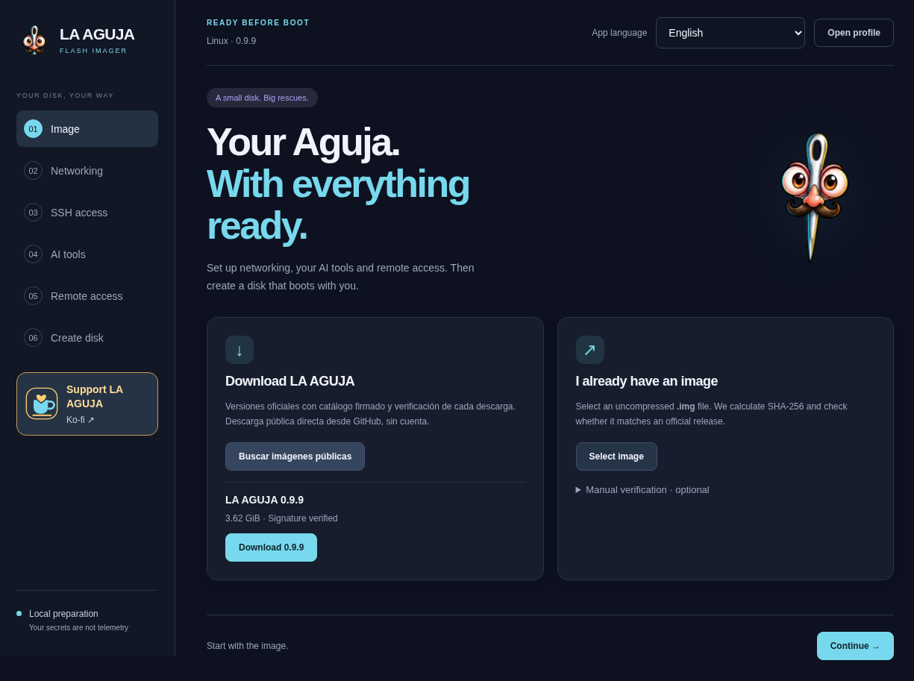
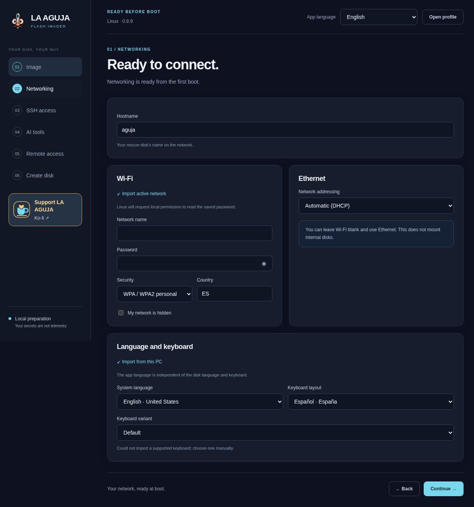
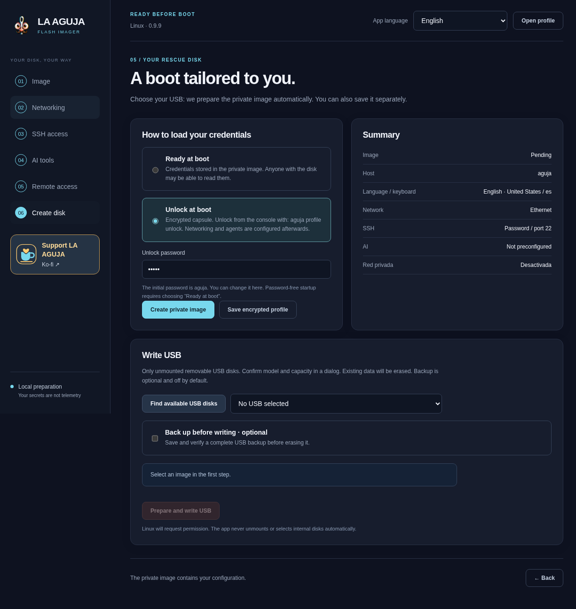

# Getting started · LA AGUJA 0.9.9

[Español](GETTING-STARTED.es.md) · [Documentation](README.md) · [Troubleshooting](TROUBLESHOOTING.md) · [Workflow ideas](SHOWCASE.md)

**Goal:** prepare a USB, boot the live system and identify the computer and its disks—without repairing the original yet. No AI account is needed for this first milestone.

## 1. Gather the right things

- A working Windows or Linux preparation computer, Internet for downloads and enough free space for the downloaded image, a decompressed base and a new private image. Optional full-USB backups need additional space based on the whole device, not just occupied files.
- An x86-64 target computer capable of USB boot. BIOS/UEFI support is not universal Secure Boot or hardware certification.
- A USB whose **actual capacity** exceeds the selected image requirement. Its contents will be replaced when flashed.
- Permission to examine the target and a **separate healthy recovery destination** if you later copy data. Backing up the rescue USB is not backing up the target computer.
- The owner's BitLocker/LUKS recovery keys where applicable. LA AGUJA does not bypass encryption.

If the original disk clicks, repeatedly disconnects or contains irreplaceable data, stop repeated scans and consider professional recovery before powering it further. Do not change firmware or encryption settings casually; have recovery keys and the owner's approval.

## 2. Download the preparer and image

[Official download page](https://aguja.transcendenceia.net/en) · [Imager 0.9.9 release](https://github.com/Transcendenceia/La-Aguja/releases/tag/v0.9.9)

| File | Purpose |
| --- | --- |
| Windows EXE / Linux AppImage, DEB or portable archive | Runs Flash Imager on the preparation PC |
| Rescue `.img.zst` | Compressed USB image; decompress before manual import |
| Rescue `.img` | Base image that Imager can personalise and flash |
| Rescue ISO | Useful for VM/optical-style boot tests; not the configurable IMG preparation flow |
| `.aguja` | Reusable private configuration profile, not an OS image |

Prefer the Imager's signed catalogue: it verifies an Ed25519 signature, download parts and the complete image hash. For manual downloads use the [0.9.9 image](https://aguja.transcendenceia.net/releases/aguja-0.9.9-amd64.img.zst), [ISO](https://aguja.transcendenceia.net/releases/aguja-0.9.9-amd64.iso) and [published Rescue checksums](https://aguja.transcendenceia.net/releases/SHA256SUMS-rescue-0.9.9.txt). Compare the hash for the exact filename. A self-calculated hash without a trusted reference does not establish origin.

Launch the Imager as your normal user. USB writing requests local elevation. Windows packages have no recognised Authenticode signature; inspect provenance rather than routinely bypassing warnings. On Linux, grant the AppImage execute permission; use the portable archive or documented extraction route if FUSE is unavailable, not sandbox-disabling flags. See the [Imager implementation guide](../desktop/README.md).



*Real packaged Linux application; some Spanish strings remain. This is not a Windows execution or a USB-write result.*

## 3. Configure a deliberately simple first profile

1. Select the catalogue image or a decompressed local IMG. Keep the original base unchanged.
2. Select **live language and keyboard**, independently of the application language. Check the keyboard before typing a new unlock phrase.
3. Use automatic Ethernet DHCP for the first boot if possible. Saved personal Wi-Fi is optional; corporate authentication and captive portals may need manual NetworkManager setup.
4. Choose a recognisable hostname and an SSH password unique to this intervention, or the authorised operator's **public** key. Never paste the private key.
5. Leave AI and private networking unconfigured for the first test if you do not need them yet. The complete 0.9.9 image still contains all four CLIs.

The SSH factory username and public password are both `aguja`. Blank password plus a public key means key-only access; blank password without a key retains factory access. Later, `aguja password` changes and persists it; `sudo passwd aguja` only affects the current session.



*Actual English-selected UI. The pictured Spanish keyboard selection is a real separate setting, not a translated screenshot. Choose your own layout.*

## 4. Protect secrets before saving

Choose **Unlock at boot** for a profile containing secrets. The initial unlock phrase is publicly known (`aguja`): replace it with your own and keep a recovery copy outside the USB. SSH password, profile phrase, provider API key and disk recovery key are different credentials.

- The encrypted capsule protects its **locked profile**. It does not encrypt all AGUJA_DATA, the entire USB or secrets already loaded and accessible to root.
- Encrypted profiles force `persistent_home=no` at boot; persistent HOME is an older/plaintext configuration option.
- `persistent_home=no` discards HOME and session tokens on reboot. `persistent_home=yes` retains them **unencrypted** on the USB.
- A plaintext `aguja.conf`, private image, profile export or backup can contain sensitive information. Do not attach them to an issue or share them as a public image.
- Saving an encrypted reusable profile is useful for repeat preparation, but does not make expired sessions or registration keys valid.



*Real Linux UI with English selected and some Spanish summary labels. No image or USB is selected in this capture; it demonstrates options, not completion. The backup option shown is Linux-only.*

## 5. Back up and write only the confirmed USB

**Flashing replaces the selected USB's contents.** First make a recoverable backup. Linux offers an optional verified full-device backup, off by default. Windows has **no integrated USB backup**: use an external tool before proceeding.

Compare the physical USB's model, serial and actual capacity with the native confirmation. Cancel if anything is unclear. “Create private image” saves a new file; “Prepare and write USB” also writes the selected device. The agent skill only prepares a file and does not automatically flash.

Wait for writing, synchronisation and complete read-back verification. In 0.9.9 the Imager checks workspace capacity before copying; Windows can choose another work folder if needed. Do not overwrite the base or choose an existing output file as a shortcut. Do not unplug during a write. A failed or interrupted write is not ready-to-boot media.

Read-back proves the written image bytes match; it does **not** certify all firmware. Windows keeps the image's AGUJA_DATA geometry rather than expanding it automatically on larger media. Installing a new Imager does not update an already-flashed USB. Review [USB backup/update procedures](USB.md) before changing existing media.

## 6. Boot, unlock and reach the first milestone

Use the target computer's manufacturer boot menu and select the USB. Do not begin an installation on the internal disk. The cockpit can fall back to text when display support requires it.

From the local console:

```sh
aguja profile unlock   # encrypted profiles only; enter the phrase interactively
aguja status
aguja doctor
lsblk -o NAME,SIZE,MODEL,SERIAL,FSTYPE,LABEL,MOUNTPOINTS
findmnt
```

Identify **rescue USB, original source and separate destination** using model/serial/size, not a remembered device letter. These commands orient you; a healthy doctor report does not establish that an internal disk is healthy or an AI account works. Do not publish raw serial numbers, fingerprints or personal paths without reviewing them.

**First milestone:** you can see the cockpit, identify the booted version, inspect status and distinguish the disks. No internal repair or cloud login is required. Booting itself does not mount, repair, install or write to internal disks.

0.9.9 local consoles retain up to 10,000 history lines in RAM. Wheel up reviews output; wheel down to the prompt or Esc returns. New consoles do not recover already-lost output, and full-screen tools may have their own navigation. This is not a saved transcript. SSH retains its normal terminal behaviour.

## 7. Optionally connect from another computer

Replace the placeholders with the actual live address and configured port:

```sh
ssh aguja@ACTUAL_LIVE_IP
# If you selected a non-default port:
ssh -p CONFIGURED_PORT aguja@ACTUAL_LIVE_IP
```

Compare the host fingerprint against the live console before trusting it. `aguja.local` depends on mDNS support, multicast and name collisions; the actual IP is the fallback. The screenshots' `10.0.2.15` is a QEMU test address, not your machine.

Optional **your own Tailscale/Headscale**: configure an authorised auth/pre-auth key, optional node name and your HTTPS Headscale URL (empty selects official Tailscale). The image must support `tailscale-profile-v1`. Registration happens on the live after networking and profile unlock, not on the preparation PC. Your client and ACLs must allow access.

Default access is normal OpenSSH over the private network; Tailscale SSH is separate and needs compatible SSH policies. Tailnet identity lives in RAM and registers again on reboot. A one-use key may be consumed on the first boot; repeat boots need valid, appropriately scoped reusable keys. Remove obsolete nodes and keys afterwards; revoking registration alone does not remove every enrolled node.

## 8. Optionally authorise an AI client

Choose **one** login command for your provider, not all of them:

```sh
aguja login codex
aguja login claude
aguja login antigravity
opencode auth login
```

Local supported login opens the official flow in sandboxed Chromium with the original PTY. You grant consent yourself. Copying focuses the console; paste explicitly with Ctrl+Shift+V. Closing returns to the original terminal. OpenCode retains native login; there is no QR in the new local browser flow.

SSH/serial/headless sessions use provider-native methods. A callback to remote localhost is not automatically forwarded. API credentials and selective portable-session imports are alternatives; installation or an imported file does not prove authentication. No whole keychain, history, hooks or MCP configuration is copied. Check the provider's account, network, quota, pricing and data policy before using it; offline cloud inference is not promised.

Start the chosen client through the launcher, for example:

```sh
aguja agent codex
```

Choose **Safe** for task confirmations; Unsafe/YOLO is explicit. **Both retain unrestricted sudo/root. Safe is not a sandbox or forensic write blocker.** Start with a [bounded diagnosis prompt](SHOWCASE.md#first-diagnosis), inspect the proposed commands and stop before unapproved writes.

## 9. Verify the result and close the intervention

For a first boot, record the version, verified image source and observed hardware/boot limits. For later recovery, open sample files at the destination and check the agreed result rather than trusting an exit code. Save authorised evidence outside RAM, without secrets. Console history is not a case report.

Finish transfers, unmount recovery volumes cleanly and shut down before disconnecting media. Remove only the temporary access you created, revoke unneeded keys and review persistent HOME for remaining tokens. Preserve originals and backups until the owner accepts the outcome. Never clean up by deleting unrelated access or evidence.

Next: [eight practical workflows](SHOWCASE.md) · [troubleshooting](TROUBLESHOOTING.md) · [current release evidence](RELEASE-0.9.9.md).
