# LA AGUJA · Manual para usuarios

8 de octubre de 2026 · versión pública 0.9.0 en preparación.

[Manual navegable con capturas, búsqueda e impresión](https://aguja.transcendenceia.net/docs). [PDF del manual](https://github.com/Transcendenceia/La-Aguja/releases/download/v0.9.0/LA-AGUJA-Manual-usuarios-20261007.pdf). Acceso privado conservado.

## Una entrada pequeña. Control completo.

LA AGUJA es un Linux de rescate que arranca desde un USB antes del sistema instalado. Te da una consola, herramientas de recuperación y cuatro arneses de IA para investigar y actuar sobre un equipo que necesita ayuda. **Agujita abre la puerta; tú decides qué se hace detrás.**

Flash Imager prepara ese USB desde Windows o Linux. Rescue Disk es lo que arranca en el equipo. Tu tailnet conecta al técnico o asistente por SSH. No hay cuenta de LA AGUJA: las descargas son públicas en GitHub. Las cuentas IA y la administración de la tailnet son independientes.

**Tu PC (Flash Imager) → Tu USB (Rescue Disk) ↔ Tu técnico o IA (SSH en tu tailnet)**

El sistema live permite operar cuando el sistema interno no inicia. No instala, repara ni monta automáticamente los discos internos al arrancar. La raíz del live está en RAM; el área de datos del USB puede conservar trabajo. Una herramienta disponible no significa que sea seguro ejecutarla contra cualquier disco.

### Potente de verdad, no una demostración sin consecuencias

El usuario `aguja` puede obtener root con `sudo -n`. Los arneses en modo completo pueden modificar discos, redes y sistemas de archivos. No hay un aislamiento que haga inocuo un comando equivocado. Dar al agente un objetivo de «solo lectura» es una instrucción, no una barrera técnica. Antes de escribir, identifica el destino y verifica una copia recuperable.

Actualizado el 8 de octubre de 2026 · versión pública 0.9.0 para Windows/Linux · experimental · código abierto. Las capturas emplean datos sintéticos; los límites y comprobaciones se indican al final.

### ¿Por qué usar LA AGUJA?

Si Windows o Linux no arranca, las herramientas instaladas dentro de ese sistema tampoco están a tu alcance. LA AGUJA arranca **por otro camino**: desde un pendrive, con su propio Linux. Así puedes observar el equipo, buscar el origen del fallo y preparar una recuperación sin depender de que el sistema averiado funcione.

Su diferencia no es «una IA que arregla todo con un clic». Es reunir **herramientas de rescate, agentes de IA, red preparada y acceso remoto** en un entorno que puedes llevar contigo. La IA ayuda a interpretar resultados y construir un procedimiento; las herramientas hacen el trabajo real. Puedes usarlo también sin IA.

EMPIEZO DESDE CERO

### No sé de Linux ni de discos

Sigue la receta mínima y el glosario. Primero aprenderás a arrancar y reconocer lo que ves; no necesitas reparar nada para practicar.

[Mi primer USB →](https://aguja.transcendenceia.net/docs#primer-usb)

YA ME DEFIENDO

### Quiero rescatar o dar soporte

Configura IA, SSH y, si hace falta, una red privada. Aprende a formular un objetivo y comprobar el resultado.

[Mi primer diagnóstico →](https://aguja.transcendenceia.net/docs#primer-diagnostico)

USO PROFESIONAL

### Necesito un procedimiento reproducible

Identidades de dispositivos, imágenes de trabajo, sesiones persistentes, evidencias y entrega. Las herramientas no sustituyen el criterio técnico.

[Ruta profesional →](https://aguja.transcendenceia.net/docs#profesional)

### ¿Cuándo no es la primera herramienta que necesitas?

Si solo quieres instalar una app en un equipo que funciona, utiliza tu sistema habitual. Si necesitas un instalador oficial de Windows, LA AGUJA no incluye Windows ni su licencia. Si el equipo no enciende, hay olor a quemado o el almacenamiento desaparece repetidamente, puede hacer falta asistencia física: un USB no repara componentes electrónicos.

## Tu primer USB, sin complicarte

Objetivo de esta primera vuelta: **ver el panel de LA AGUJA y conocer tu equipo**. No vamos a reparar, formatear ni instalar el sistema interno. La única escritura necesaria para prepararlo es la del pendrive elegido.

Necesitas un PC Windows x64 o Linux x86-64 para preparar el USB, un pendrive vacío o respaldado que supere el tamaño real de la imagen y un equipo compatible donde probarlo. Para esta ruta usa cable Ethernet si puedes. Internet ayuda a descargar; con una imagen local y los componentes necesarios, preparar no exige cuenta web.

- **Descarga Flash Imager para tu sistema.** Ábrelo como usuario normal. Es la app preparadora, no el sistema de rescate. [Ver los formatos y su comprobación](https://aguja.transcendenceia.net/docs#descargas).

- **Elige la imagen de Rescue Disk.** Pulsa Buscar versión estable sin registrarte, o Seleccionar imagen si ya tienes la `.img`. Un EXE o un AppImage no se graba en el USB.

- **Deja Ethernet en Automática (DHCP).** En Red, usa un nombre como `rescate-ejemplo`, elige idioma y teclado. Wi-Fi puede quedar vacío si usarás cable. [Qué significa cada campo](https://aguja.transcendenceia.net/docs#red).

- **Personaliza SSH.** En Acceso SSH, usa Crear una contraseña única o pega una clave pública propia. Conserva el puerto 22 si no necesitas otro. Esa contraseña sirve para entrar al live, no para desbloquear Windows.

- **Deja IA sin preconfigurar y red privada desactivada para esta prueba.** No necesitas ninguna de ellas para arrancar y consultar el equipo. Podrás iniciar sesión en IA después.

- **En Crear disco, revisa el resumen y la protección.** Si hay secretos, elige Desbloquear al arrancar y guarda la frase fuera del USB. La necesitarás físicamente en el equipo de rescate.

- **Busca el USB y confirma su identidad.** Pulsa Buscar USB disponibles, selecciona tu pendrive y luego Preparar y grabar USB. Compara modelo, capacidad y serie en la confirmación. Si dudas, cancela; no lo averigües grabando.

- **Espera el resultado de lectura verificada.** Autoriza UAC/Polkit cuando lo pida la operación. No retires el USB mientras trabaja. Ahora tienes un medio preparado; aún falta probar que arranque en tu equipo.

- **Arranca desde el USB.** Usa el menú de arranque del fabricante. Si cifraste el perfil, abre la consola local y ejecuta `aguja profile unlock`. [Ver arranque y desbloqueo](https://aguja.transcendenceia.net/docs#arranque).

- **Comprueba que llegaste al live.** Debes ver el panel de LA AGUJA; en su consola ejecuta los comandos de abajo. Identifica el USB y los discos internos sin montarlos. Después puedes apagar el live y volver a tu sistema normal.

```
# En el Rescue Disk, no en PowerShell del PC preparador
aguja status
aguja doctor
lsblk -o NAME,SIZE,MODEL,FSTYPE,LABEL,MOUNTPOINTS
```

### Así sabes que la primera vuelta terminó

Viste el panel, comprobaste el estado y reconociste el USB frente al almacenamiento interno. **No necesitas recuperar un archivo ni autenticar cuatro proveedores** para completar este aprendizaje. Si no hay Internet, el inventario local sigue disponible.

**Dos roles:** el PC preparador crea el pendrive; el equipo de rescate lo arranca. Pueden ser el mismo equipo en momentos distintos, pero no confíes en poder preparar el USB dentro de un Windows que ya no inicia: prepáralo antes o utiliza otro PC.

## Las palabras que vas a encontrar

No tienes que memorizar estas palabras: vuelve aquí cuando un paso te resulte confuso.

| Palabra | En lenguaje cotidiano | En LA AGUJA |
| --- | --- | --- |
| Live / Rescue Disk | Un sistema que puedes arrancar sin instalarlo en tu disco interno. | El Linux del pendrive. Su raíz usa RAM y sus datos pueden vivir en el USB. |
| Flash Imager | La aplicación que prepara el pendrive. | Se abre en Windows/Linux; no repara por sí misma el PC averiado. |
| Imagen .img / ISO | Un archivo que representa un medio completo, no una foto. | La IMG es el disco configurable del Imager; la ISO sirve para recorridos de arranque como VMs. No son intercambiables aquí. |
| Disco / partición / montaje | El dispositivo completo / una zona de él / hacer accesibles sus archivos. | /dev/sda puede ser un disco y /dev/sda1 una partición; esas letras cambian. Se identifican, no se adivinan. |
| IP / puerto / DHCP | Dirección de red / puerta de un servicio / asignación automática de dirección. | SSH usa la IP actual y su puerto. DHCP evita inventar una dirección de otra red. |
| Terminal / CLI | Una ventana donde escribes órdenes y lees respuestas. | El Imager abre un terminal para el CLI oficial de IA; el live también tiene consola propia. |
| SSH / huella | Conexión cifrada para manejar otra consola / identidad comprobable del servidor. | La cuenta es aguja. Compara la huella antes de confiar en la primera conexión. |
| Root / sudo | Permiso de administrador del Linux. | Control completo. No significa «solo lectura» ni evita equivocarte de disco. |
| Tailnet / Headscale | Red privada de dispositivos autorizados / servidor propio para administrarla. | Opcional para soporte remoto; necesita alta, conectividad y política compatible. |
| Auth key / API key / OAuth | Clave para registrar un nodo / clave de un servicio / consentimiento de inicio de sesión. | Son tres cosas distintas. Ninguna sustituye la contraseña SSH o la frase del perfil. |
| Cápsula / perfil .aguja | Configuración que viaja dentro de la imagen / plantilla reutilizable cifrada. | La cápsula se carga al arrancar. El archivo .aguja se abre en el Imager para repetir una preparación. |
| SHA-256 / verificación | Una huella de los bytes / comparación de lo leído con lo esperado. | Ayuda a detectar archivos o grabaciones distintos. No garantiza que el hardware pueda arrancarlos. |
| BitLocker / LUKS | Cifrado de volúmenes. | Leerlos requiere la clave apropiada. La frase del perfil del USB no descifra el disco interno. |

## Antes de empezar: equipo, permisos y respaldo

- **Confirma el equipo.** La imagen es x86-64. El proyecto contempla arranque BIOS y UEFI; ARM, todos los controladores Wi-Fi y cualquier firmware no están garantizados. No se ofrece una cadena Secure Boot firmada universal: revisa el firmware y la política del propietario antes de cambiarlo.

- **Elige un USB cuya capacidad real supere el tamaño de la imagen.** Compruébalo en el catálogo y la aplicación. «16 GB» comerciales y GiB mostrados no son la misma medida. Guarda fuera del USB lo que quieras conservar: la grabación lo reemplaza.

- **Obtén permiso sobre el equipo y los datos.** Define qué disco se investigará, qué datos se pueden copiar, qué proveedor IA se usará y cuándo hay que detenerse. Un propietario de la máquina no siempre es el titular de todos sus datos.

- **Prepara conectividad.** Ethernet DHCP suele ser el camino más simple. Guarda Wi-Fi si hace falta. Para alta en tailnet y OAuth necesitas red, DNS, HTTPS y hora correcta; el rescate local sigue siendo posible sin Internet.

- **Prepara una copia o destino de recuperación.** Debe ser distinto del dispositivo que falla. Si el disco hace ruidos, desaparece o acusa errores de lectura, evita reparaciones repetidas sobre el original: puede convenir una imagen primero y trabajo sobre la copia.

No necesitas tener instalado el sistema del disco interno para leer sus particiones desde el live. Sí necesitas las claves correctas de BitLocker/LUKS cuando haya cifrado: LA AGUJA no lo rompe ni evita la autorización.

### Respaldo de USB: Windows y Linux no ofrecen lo mismo

**Windows:** el respaldo previo integrado todavía no está implementado. La opción no se ofrece y el backend rechaza una solicitud de respaldo antes de escribir. Copia los archivos o haz una imagen con tu herramienta de respaldo antes de grabar. **Linux:** hay respaldo completo opcional con verificación, desmarcado por defecto; exige espacio suficiente y permisos. El respaldo del USB no es un respaldo del disco interno del equipo que vas a rescatar.

## Descargar y abrir Flash Imager

Abre [las descargas para Windows y Linux](https://aguja.transcendenceia.net/#application). Usa el formato de tu plataforma, conserva su nombre y verifica el SHA-256 que acompaña la publicación. Los ejemplos de descarga corresponden a la candidata pública 0.9.0. Comprueba que la release está publicada antes de descargar; las capturas históricas conservan su versión en el pie. Comprueba siempre la publicación que descargas.

| Formato | Cómo abrir | Qué tener en cuenta |
| --- | --- | --- |
| Windows x64 · EXE portátil | Ejecuta aguja-flash-imager-0.9.0-win-x64.exe. | No necesitas Node.js. UAC se solicita para grabar, no para configurar. No se promete firma de editor ni ausencia de SmartScreen. |
| Linux · AppImage | Hazlo ejecutable y ábrelo como tu usuario. | FUSE o extracción soportada; no abras la app como root ni desactives el sandbox de Electron. |
| Debian/Ubuntu · DEB | Instala el paquete local con tu gestor. | La instalación puede necesitar administrador y paquetes del sistema. |
| Linux · TAR portátil | Extrae la carpeta y ejecuta el binario de la aplicación. | Conserva los archivos de la carpeta; preparar una imagen necesita los helpers del sistema. |

```
# Linux, desde la carpeta de descarga
sha256sum aguja-flash-imager-0.9.0-x86_64.AppImage
chmod +x aguja-flash-imager-0.9.0-x86_64.AppImage
./aguja-flash-imager-0.9.0-x86_64.AppImage
```

```
# PowerShell, desde la carpeta de descarga
Get-FileHash .\aguja-flash-imager-0.9.0-win-x64.exe -Algorithm SHA256
```

Compara el resultado completo, no solo sus primeros caracteres. Un hash calculado te permite comparar bytes; **no prueba por sí solo quién publicó un archivo**. La aplicación verifica el catálogo firmado Ed25519 con una clave incluida en el paquete. Esa firma no convierte en confiable una aplicación obtenida de una fuente desconocida.

La web es pública e informativa. Descargar y preparar no requiere registro en LA AGUJA.

Descarga también las sumas de [Flash Imager Linux 0.8.2](https://github.com/Transcendenceia/La-Aguja/releases/download/v0.9.0/SHA256SUMS-imager-0.9.0-linux) o [Flash Imager Windows 0.8.2](https://github.com/Transcendenceia/La-Aguja/releases/download/v0.9.0/SHA256SUMS-imager-0.9.0-windows). Guarda el archivo junto al artefacto que descargaste, conservando sus nombres. En Linux:

```
sha256sum --ignore-missing -c SHA256SUMS-imager-0.9.0-linux
```

Debe aparecer `OK` para tu archivo. «No se pudo verificar ningún archivo» no significa éxito: comprueba la carpeta y los nombres. En Windows, compara el SHA-256 de `Get-FileHash` con la línea correspondiente del archivo de sumas; no ignores una discrepancia.

### Si AppImage no abre por FUSE

Prueba el modo de extracción y ejecución del propio AppImage. Mantiene el sandbox; no abras la app con `sudo` ni añadas `--no-sandbox` para resolverlo.

```
./aguja-flash-imager-0.9.0-x86_64.AppImage --appimage-extract-and-run
```

**Si Windows muestra un aviso:** verifica origen y hash antes de continuar. No desactives globalmente el antivirus o SmartScreen. Las descargas son públicas y no requieren registro en LA AGUJA. Las cuentas y créditos de IA pertenecen al proveedor elegido.

## Paso 1 · Elegir una imagen compatible

En **Imagen**, usa el catálogo o **Seleccionar imagen**. El Imager trabaja con `.img` sin comprimir. Si recibiste `.img.zst`, descomprímelo primero en una carpeta con espacio suficiente. Una ISO no sustituye el disco configurable AGUJA_CFG/AGUJA_DATA del recorrido del Imager.

```
# Descomprimir un archivo recibido; no escribe ningún USB
zstd -d aguja-0.8.0-amd64.img.zst
```

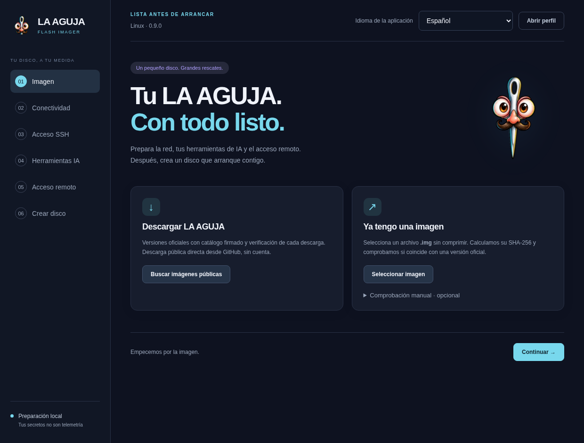

Captura del paquete Linux 0.9.0 real con estado de ejemplo. ① Seleccionar imagen calcula su SHA. ② Buscar versión estable consulta el catálogo firmado. ③ Comprobación manual es opcional. No representa un login ni una autorización de proveedor.

El estado distingue **versión oficial verificada**, **SHA comparado** e **imagen local de origen no comprobado**. Si la comprobación manual no coincide, no se usa la nueva selección. No ignores esa diferencia para un medio que tendrá acceso completo a tus discos.

Para alta automática de tailnet, la imagen debe anunciar `tailscale-profile-v1`. Una imagen antigua se rechaza antes de preparar el perfil; actualizar solo el EXE/AppImage no añade Tailscale a un live ya construido. Mantén Imager e imagen compatibles. También existen guardas de idioma/teclado e importación OAuth Antigravity.

### Qué debes ver al terminar este paso

La app debe mostrar el archivo seleccionado, su tamaño y el resultado de la comprobación. Si no coincide con el SHA esperado, detente y descarga de nuevo desde la fuente correcta. Un nombre con «oficial» no prueba procedencia. Para el USB final y una imagen privada intermedia necesitas espacio libre suficiente; el espacio del PC y la capacidad del pendrive son dos comprobaciones distintas.

## Paso 2 · Red, idioma y nombre del equipo

- Elige idioma, distribución y variante de teclado. El idioma de la app es independiente del teclado que tendrá el disco. Prueba los signos de tu contraseña antes de depender de una consola remota.

- Da al equipo un nombre simple con minúsculas, números y guiones. Evita incluir el nombre completo de una persona o información de un cliente.

- Usa Ethernet automático (DHCP), salvo que conozcas dirección, prefijo, puerta de enlace y DNS correctos de esa red. Una IP estática de otra red puede impedir conectarte.

- Si necesitas Wi-Fi, escribe SSID, seguridad y contraseña; marca red oculta solo si corresponde. Importar desde tu PC evita errores de escritura, pero no garantiza que el hardware del equipo rescatado tenga ese controlador.

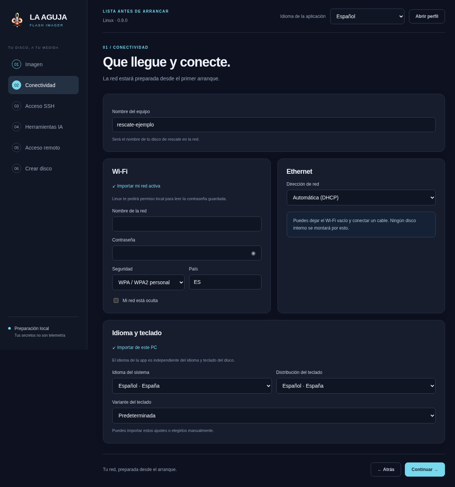

Captura Linux 0.9.0 con nombre de equipo de ejemplo. Revisa idioma/teclado antes de SSH; DHCP y Wi-Fi son configuraciones distintas. La app puede pedir permisos locales para importar una contraseña Wi-Fi existente.

Una interfaz con IP no garantiza salida a Internet. Una tailnet necesita acceso al plano de control y, según la topología, a relés de transporte. Prueba DNS y conectividad en el live cuando arranque. El Imager no inscribe tu PC personal ni reemplaza su cliente VPN al guardar estos datos.

### Ejemplo sencillo, campo por campo

- **Nombre del equipo:** `rescate-ejemplo`; aparecerá en la red. No es el nombre de tu cuenta.

- **Ethernet → Automática (DHCP):** el router asigna la dirección. No escribas una IP fija salvo que conozcas esa red.

- **Nombre de la red Wi-Fi:** el SSID exacto, respetando mayúsculas. La contraseña puede ser distinta de la de administración del router.

- **Idioma de la aplicación:** cambia lo que ves en el Imager. **Idioma del sistema / teclado:** cambia el live que prepararás. Son ajustes separados.

**Resultado esperado:** el resumen refleja el nombre y el tipo de red. Todavía no has conectado el equipo de rescate: eso se comprobará después de arrancar.

## Paso 3 · SSH: tu puerta de entrada

Selecciona una contraseña sólida o pega la **clave pública** de quien asistirá. La clave privada permanece en su equipo: nunca la pegues en el Imager. Puedes usar un puerto diferente de 22 si tu política de red lo contempla. Esa configuración vale para OpenSSH, tanto en la LAN como por la IP privada de la tailnet.

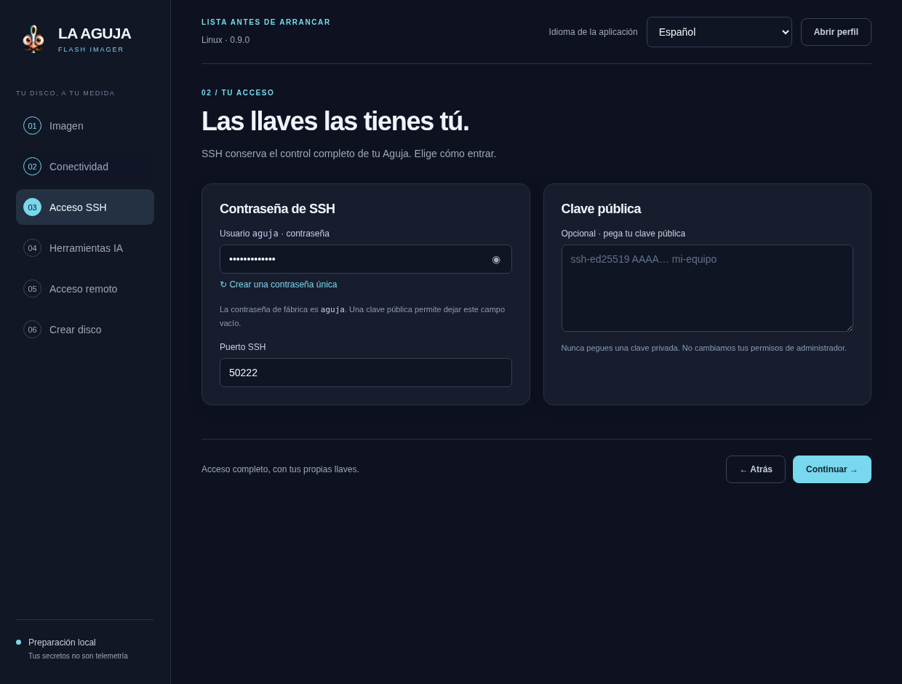

Captura con contraseña sintética oculta y puerto 50222 de ejemplo. La contraseña del perfil no aparece en el resumen. Un puerto distinto no sustituye la autenticación ni las reglas de acceso.

```
# En el equipo del técnico; solo lee una clave pública ya existente
cat ~/.ssh/id_ed25519.pub

# PowerShell equivalente
Get-Content $env:USERPROFILE\.ssh\id_ed25519.pub
```

Si no existe una clave, genera una en tu equipo con tu herramienta SSH y protégela según tu política. No compartas `id_ed25519` sin `.pub`. El disco de fábrica puede tener acceso conocido para puesta en marcha: **personaliza SSH antes de llevarlo a una red compartida**.

Al conectar por primera vez, compara la huella anunciada en la pantalla del Rescue Disk con la de tu cliente SSH. Si cambió tras regrabar o cambiar de USB, verifica la causa; no desactives `StrictHostKeyChecking` para hacer desaparecer el aviso. La dirección de tailnet puede cambiar entre registros.

## Paso 4 · Preparar IA en el Imager

Abre **Herramientas IA**. Encontrarás Codex CLI, Antigravity CLI, Claude Code y OpenCode. Puedes preparar uno, varios o ninguno; las herramientas locales de diagnóstico no requieren tenerlos todos autenticados.

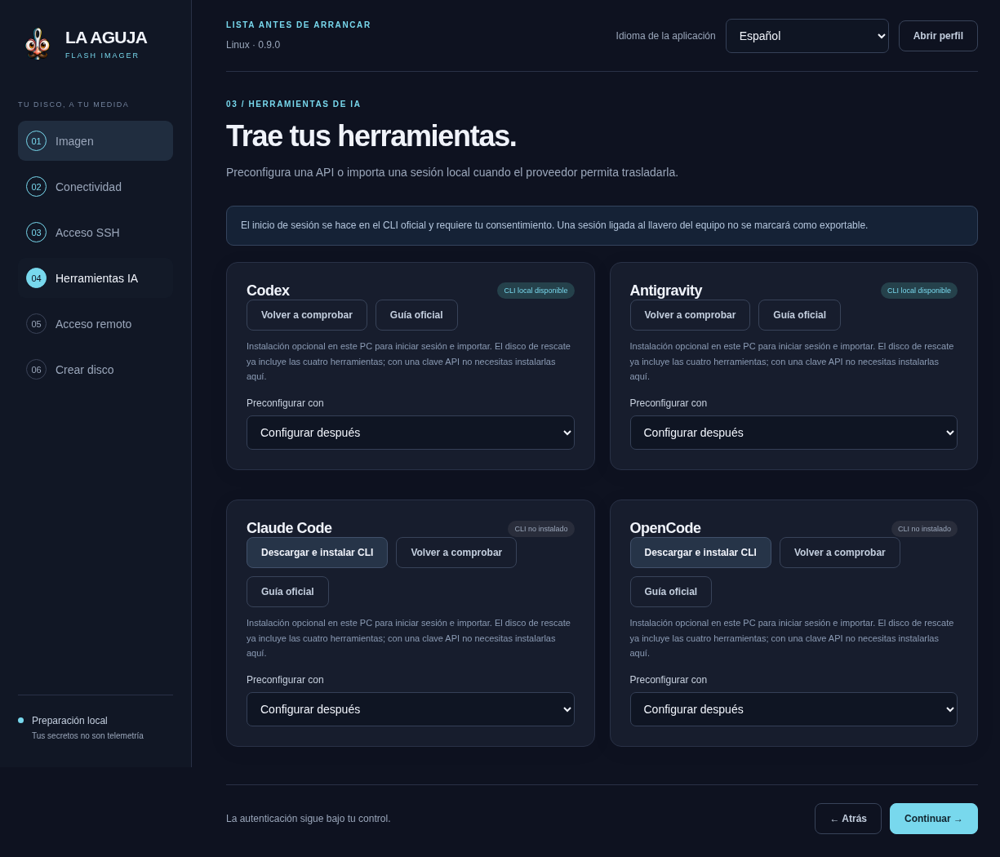

Paquete Linux real 0.9.0. Las tarjetas muestran comprobación/instalación, modo y acciones de sesión. No se autorizó ninguna cuenta en esta captura; Linux y Windows comparten este recorrido, pero esta no es una captura Windows.

| Quiero… | Elijo… | Qué pasa realmente |
| --- | --- | --- |
| Aprender primero, sin configurar IA | Configurar después | El live arranca; puedes iniciar sesión después si tienes red y cuenta. |
| Usar una clave de servicio autorizada | Clave API | La clave viaja en la cápsula. Modelo/endpoint deben corresponder al proveedor; cuotas y costes son suyos. |
| Llevar una sesión compatible del PC | Mi sesión de este equipo | Se validan solo archivos portables admitidos. Un llavero ligado al sistema no se convierte automáticamente en sesión portable. |

### Importar una sesión, paso a paso

- En la tarjeta del proveedor, comprueba si su CLI está disponible en **este PC preparador**. Si debes instalarlo, utiliza la acción ofrecida y verifica el resultado. No es una comprobación de Internet ni de tu suscripción.

- Selecciona **Mi sesión de este equipo**. Si todavía no tienes sesión local, pulsa **Iniciar sesión en este PC**. Se abre un terminal real del proveedor: completa allí su autorización oficial.

- Comprueba el dominio y la cuenta antes de consentir. Si cierras sin terminar o el CLI falla, no has iniciado sesión. El mensaje «se abrió el CLI» solo confirma que se abrió el terminal.

- Vuelve al Imager y pulsa **Comprobar e importar** en la tarjeta. Aún no se ha importado significa exactamente eso: el lanzamiento anterior no terminó la importación por ti.

- Comprueba el estado que devuelve la app. Si dice que el formato no es portable, utiliza API si corresponde o inicia sesión directamente en el live; no copies todo el llavero como atajo.

- Revisa el resumen y cifra la cápsula antes de prepararla. Al arrancar, verifica que el proveedor puede trabajar: un archivo aceptado puede contener una sesión caducada.

**Tres autorizaciones independientes:** proveedor IA, alta Tailscale/Headscale y SSH. LA AGUJA no solicita una cuarta cuenta para descargas.

No publiques API keys, códigos o URLs de autorización en capturas. La IA en nube necesita Internet y puede enviar al proveedor las instrucciones, resultados y archivos que uses; elige los datos conforme a tu tarea.

## Paso 5 · Tailscale o tu propio Headscale

En **Acceso remoto**, activa **Red privada Tailscale / Headscale** solo si la necesitas. Con el interruptor apagado, los nuevos perfiles no llevan la clave de alta; tampoco crean, vinculan ni copian credenciales del túnel propietario anterior.

| Campo | Tailscale oficial | Headscale propio |
| --- | --- | --- |
| Clave de alta | Auth key de tu administrador. | Pre-auth key de tu servidor. |
| URL de Headscale | Déjala vacía. | Origen HTTPS accesible, por ejemplo https://headscale.example.invalid; el dominio de ejemplo no funciona. |
| Nombre del nodo | Opcional. Vacío utiliza el nombre del equipo; minúsculas, números y guiones. |
| Tailscale SSH | Desactivado por defecto: OpenSSH normal utiliza contraseña/clave y puerto del paso anterior. |
| Aceptar rutas | Desactivado por defecto. Solo si necesitas rutas de subred ya anunciadas y aprobadas por tu administrador. |

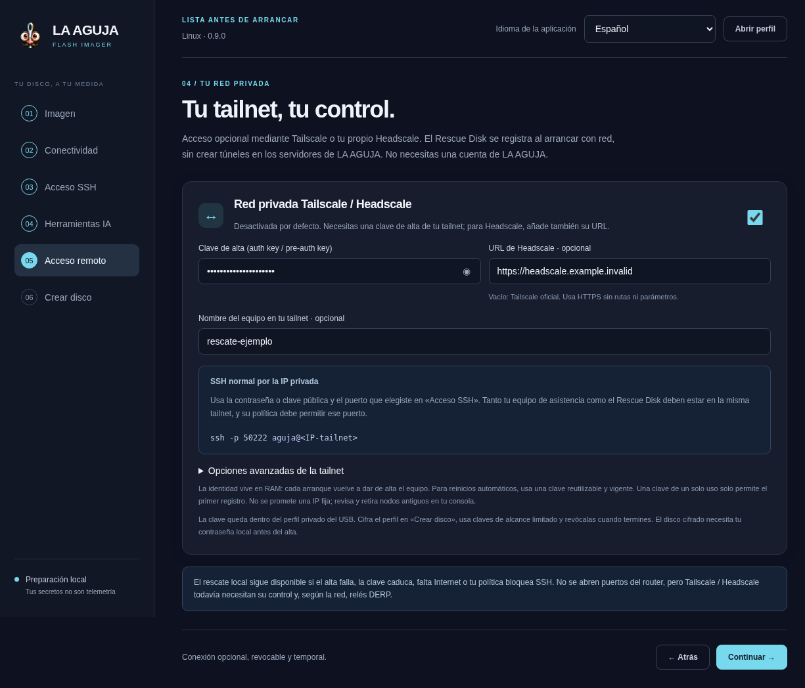

Captura de ejemplo con dominio no resoluble y clave sintética oculta. ① Activar habilita el alta en el disco, no en este PC. ② URL vacía elige Tailscale oficial. ③ SSH normal no requiere marcar Tailscale SSH. No se ha inscrito una cuenta personal para esta captura.

### Ruta A · Tailscale oficial

- En la consola oficial de tu organización, crea una auth key apropiada para el rescate: vigencia suficiente, alcance limitado y requisitos de aprobación según tu política.

- Para reinicios sin nueva intervención necesitas una clave reutilizable; consulta el apartado de reinicios antes de generarla. Si eliges nodos efímeros, entiende también su limpieza.

- Pega la clave en el campo oculto; deja URL vacía y cifra el perfil del USB.

- El equipo de asistencia debe usar esa misma tailnet. Tu administrador debe permitirle llegar a la IP del disco en el puerto de OpenSSH elegido.

### Ruta B · Headscale propio

El administrador obtiene la pre-auth key en su servidor, no en el equipo del cliente. Comprueba la ayuda de tu versión: opciones y representación del usuario pueden cambiar. La guía oficial actual muestra:

```
# Solo en TU servidor Headscale, con su usuario de administración
headscale version
headscale preauthkeys create --help
headscale preauthkeys create --user
```

`<USER_ID>` es un marcador: sustitúyelo por el identificador correcto. El último comando crea un secreto y lo muestra al administrador; no lo ejecutes en una sesión grabada ni publiques su salida. La clave predeterminada documentada es de un uso y una hora: para repetir arranques, configura la opción reutilizable y una caducidad adecuada usando la ayuda de tu versión. Pega la clave en el Imager y usa tu URL HTTPS real. [Guía oficial de Headscale](https://headscale.net/stable/usage/getting-started/).

### Sin túnel de LA AGUJA no significa sin infraestructura

El nuevo SSH no usa nuestro servidor como relay de consola. El plano de control Tailscale/Headscale y los DERP necesarios siguen teniendo disponibilidad, políticas, tráfico y posibles costes. Tener Headscale propio no hace que todos los enlaces sean directos ni borra las responsabilidades de su operador.

## SSH normal y Tailscale SSH no son lo mismo

**La ruta recomendada es OpenSSH sobre tailnet.** Tailscale transporta la conexión privada; el servidor OpenSSH autentica con tu contraseña o clave pública. La ACL/grant de red debe permitir el puerto. La auth key solo inscribe el nodo, no concede acceso universal a cualquier persona.

**Tailscale SSH** es la opción avanzada distinta: intercepta el puerto 22 en la IP de tailnet y utiliza identidad y políticas SSH del plano de control. Requiere autorización de red y reglas SSH compatibles; no usa de la misma forma la contraseña o `authorized_keys` de OpenSSH. El puerto personalizado de OpenSSH no se convierte en puerto de Tailscale SSH. En Headscale, revisa la compatibilidad y la política de tu versión. [Referencia oficial de Tailscale SSH](https://tailscale.com/docs/features/tailscale-ssh).

```
# Desde el equipo de asistencia YA conectado a la misma tailnet
# IP de EJEMPLO: sustitúyela por la mostrada en el Rescue Disk
ssh aguja@100.64.0.10

# Si configuraste OpenSSH en otro puerto
ssh -p 50222 aguja@100.64.0.10
```

Windows puede usar su cliente OpenSSH en PowerShell; Linux puede usar el mismo comando desde terminal. MagicDNS o un nombre Headscale depende de DNS y configuración: la IP mostrada es la referencia para diagnosticar. No compartas la auth key para que un técnico entre; inscribe y autoriza su propio dispositivo en tu organización.

La aceptación de rutas de subred es opcional y no anuncia nuevas rutas: el Rescue Disk no se convierte automáticamente en router, exit node ni acceso completo a la LAN. Mantén esa opción apagada salvo necesidad explícita.

## Secretos: qué se guarda y qué protege el cifrado

| Dato | Destino | Decisión del propietario |
| --- | --- | --- |
| Wi-Fi, acceso SSH, API keys, auth key de tailnet | Cápsula privada del USB y memoria del live al cargarla. | Cifrar la cápsula; restringir uso, vigencia y custodia del USB. |
| Sesión OAuth nativa importada | Solo archivos portables permitidos, dentro de la cápsula. | Importar si es necesario; comprobar vigencia y retirar permisos al terminar. |
| Identidad de tailnet | RAM del live. | Se reinscribe al reiniciar; administrar claves y nodos en el control plane. |
| Workspace, informes, clave SSH del USB | AGUJA_DATA si está disponible. | El cifrado de la cápsula no cifra todo este volumen. |

En **Crear disco**, el modo cifrado usa AES-256-GCM y scrypt. Introduce una frase de al menos 12 caracteres; no la guardes junto al USB. Un perfil reutilizable `.aguja` también se guarda cifrado, pero es distinto de la cápsula dentro de la imagen.

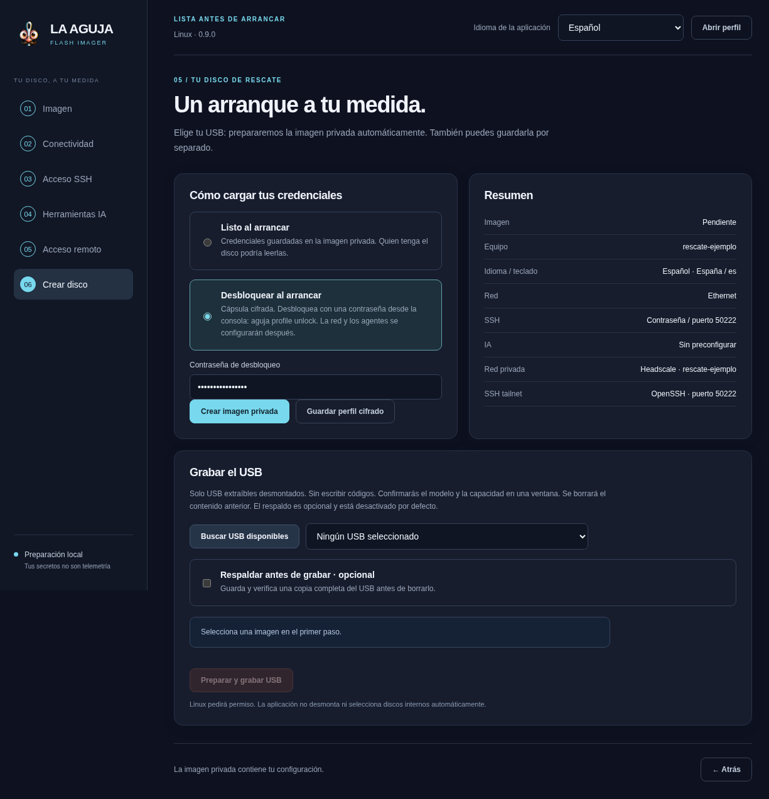

Captura con contraseña sintética oculta. El resumen enumera equipo, red, SSH e IA sin revelar claves. Seleccionar cifrado exige desbloquear en el arranque antes de cargar los datos privados.

La cápsula cifrada protege los secretos en reposo mientras está bloqueada. No protege de root ni de un agente con permisos completos una vez desbloqueada. Tampoco cifra automáticamente tus informes, los discos internos ni todo AGUJA_DATA. No uses el pendrive como almacén universal de contraseñas.

Usa placeholders al compartir instrucciones: `<AUTH_KEY>`, `<IP_TAILNET>`, `<PARTICION_ORIGEN>`. No pegues claves en nombres de máquina, etiquetas de tareas, capturas, argumentos de shell, historial, tickets o mensajes. El estado público omite secretos conocidos; no asumas que cualquier cadena desconocida puede filtrarse mágicamente.

### Tres botones que no hacen lo mismo

- **Guardar perfil cifrado:** guarda una plantilla `.aguja` para abrirla en el Imager más adelante. No graba un USB ni garantiza que las claves sigan vigentes.

- **Crear imagen privada:** genera un archivo de disco configurado. La imagen fuente se conserva; ese nuevo archivo también necesita custodia.

- **Preparar y grabar USB:** prepara la configuración necesaria y escribe sobre el pendrive confirmado. Es el paso que borra el contenido anterior del USB.

**Para reutilizar:** pulsa Abrir perfil, introduce su frase, selecciona la imagen actual y vuelve a revisar red, claves, sesiones y destinos. El perfil no es una copia de seguridad de tus documentos ni un archivo de recuperación de BitLocker universal.

## Windows · BitLocker explicado sin confusiones

BitLocker cifra datos de Windows. Arrancar un Linux externo no elimina ese cifrado. Para acceder al volumen necesitas una clave válida del propietario y un procedimiento compatible. **Comprobar, ver una clave y suspender la protección son acciones distintas.**

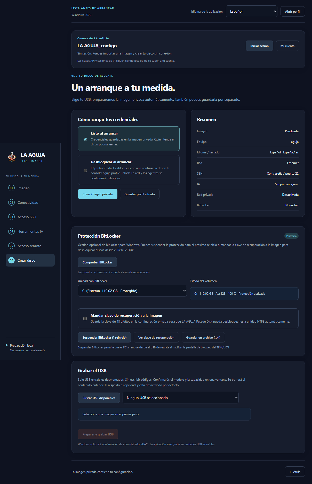

Captura nativa real de Windows 0.8.1: volumen protegido, clave no mostrada y copia a la imagen desmarcada. 0.8.2 conserva este flujo; no se presenta como una nueva ejecución Windows 0.8.2. No se suspendió BitLocker para obtenerla.

- En **Crear disco**, localiza **Protección BitLocker**. Solo aparece en Windows. Si muestra autorización pendiente, no significa «el disco no está cifrado».

- Pulsa **Comprobar BitLocker** y autoriza UAC cuando corresponda. Se eleva la consulta necesaria, no toda la aplicación. Cancelar permite volver a intentarlo.

- Selecciona la unidad y lee protección, porcentaje y método. Esa consulta no muestra ni exporta la contraseña de recuperación.

- Si tu tarea lo requiere, **Ver clave de recuperación** la muestra de forma explícita; **Guardar en archivo (.txt)** crea una copia sensible. No guardes esa copia junto al disco cifrado ni la fotografíes para soporte.

- **Mandar clave de recuperación a la imagen** permite incluir una clave disponible en la configuración privada. Está desmarcado por defecto. Cifra la cápsula y verifica volumen/clave en el procedimiento de rescate. Incluirla no implica que el disco interno se monte automáticamente al arrancar.

- **Suspender BitLocker (1 reinicio)** cambia la protección del Windows actual y requiere una decisión específica. No descifra el disco ni es un requisito general para crear el pendrive. Antes de tocar firmware o arranque, conserva una clave recuperable y consulta el procedimiento del equipo.

Si la clave no está disponible en ese Windows, el Imager no la inventa: recupérala por el canal del propietario o su administrador. El identificador de protector no es la clave numérica de 48 dígitos. El cifrado de la cápsula del USB tampoco sustituye BitLocker.

Referencia oficial: [Microsoft · recuperación de BitLocker](https://learn.microsoft.com/windows/security/operating-system-security/data-protection/bitlocker/recovery-overview). Los cambios de entorno de arranque pueden activar recuperación; no atribuyas todo aviso al pendrive.

## Paso 6 · Preparar, grabar y verificar

- Revisa el resumen y el modo de protección. **Crear imagen privada** guarda un archivo nuevo configurado sin tocar un USB.

- Para grabar, pulsa **Buscar USB disponibles** y elige la unidad extraíble correcta. Compara modelo, capacidad, dispositivo y serie. Las unidades internas no se ofrecen para ese recorrido.

- En Linux, marca respaldo previo solo si lo deseas y elige un destino distinto del USB. En Windows, realiza tu respaldo fuera de la app antes de continuar.

- **Preparar y grabar USB** crea la imagen privada automáticamente si hace falta. Si cambiaste configuración, se vuelve a preparar.

- Confirma la ventana nativa de borrado. Cancelar conserva el dispositivo. Autoriza Polkit/UAC para la operación de grabación.

- Espera escritura y verificación de lectura. Un mensaje de éxito significa bytes leídos verificados, no compatibilidad de arranque probada en todo el hardware.

No retires el USB durante la escritura. Conserva fuera del medio el hash, versión e informe de entrega. Una copia de imagen privada también contiene tus secretos: aplica la misma custodia que al USB, incluso si era un archivo intermedio.

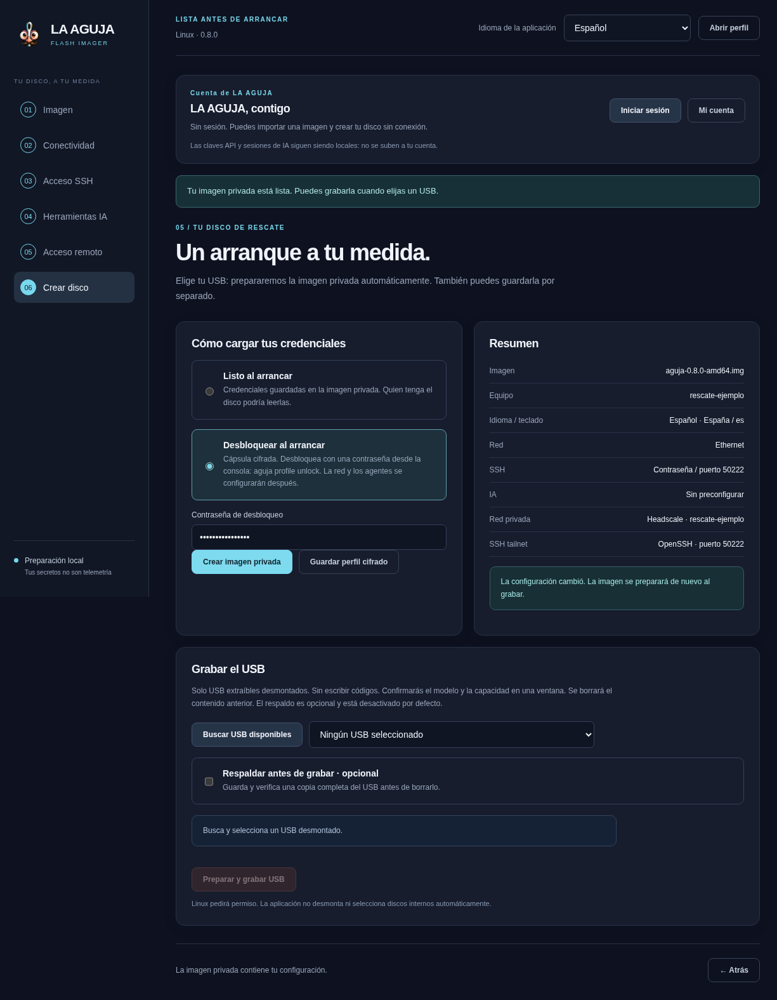

Captura histórica real del paquete 0.8.0; la captura es evidencia histórica, no una nueva prueba 0.9.0. Se prepararon imágenes en claro y cifradas con datos sintéticos y el lector real de Rescue Disk abrió ambas. Esto no es una grabación física de USB ni un alta en una tailnet personal. Elige el dispositivo solo después de comprobar su identidad y capacidad.

### Qué cambia entre Windows y Linux

| Operación | Windows | Linux |
| --- | --- | --- |
| Permiso para escribir USB | UAC para el grabador. | Polkit para la operación. |
| Respaldo previo dentro de la app | No implementado; respalda externamente primero. | Opcional, completo y verificado; necesita espacio en otro destino. |
| Espacio sobrante del USB | Conserva la geometría de la IMG; no amplía AGUJA_DATA ni recoloca GPT al final físico. | El grabador tiene una fase propia de ampliación verificada. |
| BitLocker | Consulta y acciones explícitas sobre Windows. | No aparece ese panel Windows; el live conserva herramientas de cifrado. |

**Si se interrumpe:** no confíes en un USB parcial. Conserva el error y vuelve a preparar/grabar tras identificar otra vez el destino. Un 100 % de escritura sin lectura verificada no es el resultado final esperado.

## Arrancar, desbloquear y conectarse

- Con el equipo apagado o siguiendo su procedimiento seguro, conecta el USB y elige ese medio en el menú de arranque del firmware. No cambies el orden o la seguridad del firmware sin permiso.

- Arranca la entrada apropiada de LA AGUJA. Si la presentación gráfica falla, conserva la consola o prueba el modo de arranque de respaldo disponible. No presupongas que un fallo de vídeo indica disco dañado.

- Si la cápsula está cifrada, desbloquéala en la consola local. Sin ese paso no están disponibles sus credenciales de red/SSH/IA ni el alta preconfigurada.

- Comprueba IP, puerto SSH y estado real. Si habilitaste tailnet y hay red, el disco intenta registrarse con tus datos; la app no lo había inscrito durante la preparación.

- Desde el equipo autorizado en esa misma red privada, conecta a la IP actual y compara la huella SSH. Si no hay tailnet, usa consola local o LAN autorizada.

```
# En la consola local del Rescue Disk
aguja profile unlock
aguja status --json
aguja doctor
aguja tailscale status
aguja tailscale status --json
ip -br addr
ip route
```

`aguja doctor` comprueba herramientas y servicios, no garantiza salud del disco interno ni una cuenta IA operativa. Un perfil bloqueado, un nodo esperando aprobación o un proveedor sin sesión son estados distintos. Consulta el apartado de diagnóstico para aislarlos.

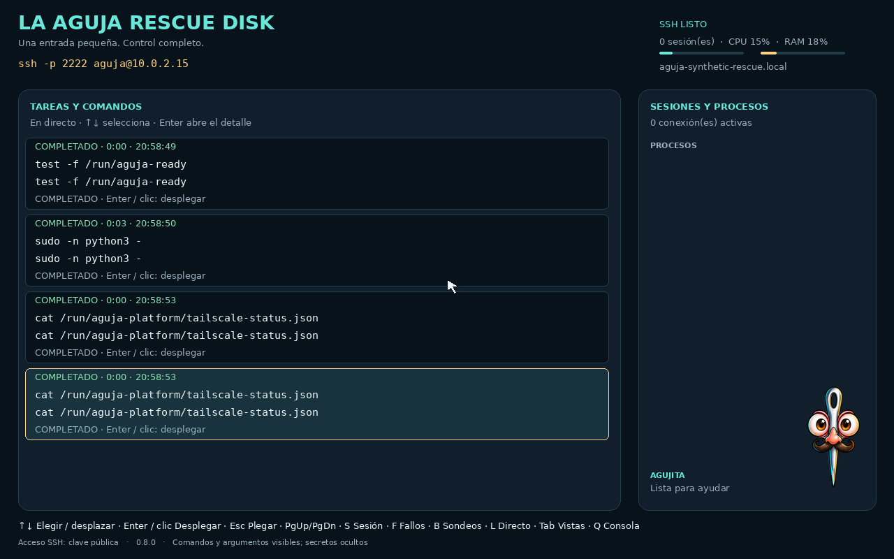

Arranque real en una VM de QA, sin discos internos conectados. La dirección y el servidor pertenecen a una tailnet aislada sintética. El estado local no demuestra por sí solo las ACL: en esta prueba se verificó además una sesión OpenSSH desde el otro nodo.

### La primera pantalla y las teclas

El cockpit muestra Agujita, estado de red e información para conectar. En los menús utiliza flechas, números y Enter según las opciones visibles. No es un escritorio de Windows: la consola es el lugar donde ejecutas órdenes. Si tu hardware no permite la vista gráfica, la consola de texto sigue siendo el camino de respaldo.

La tecla del menú de arranque depende del fabricante; consulta su manual. Selecciona el pendrive, no una entrada de instalación del disco interno. No hay una tecla ni una política Secure Boot universal para todos los equipos.

### Cuatro comprobaciones separadas

**Arrancó:** ves el live. **Perfil cargado:** tus ajustes están disponibles. **Red disponible:** hay una ruta útil, no solo una IP. **Asistencia disponible:** el cliente autorizado puede entrar por SSH. Pasar una no prueba las otras.

## Reinicios: la identidad de tailnet es temporal

El diseño del live mantiene el estado de tailnet en RAM. Al apagar se pierde esa identidad; un nuevo arranque vuelve a registrarse. **Una clave de un solo uso puede funcionar la primera vez y fallar la segunda.** Cifrar la cápsula no cambia esa regla.

- Para repetir rescates o reinicios sin regrabar, usa una auth/pre-auth key reutilizable, vigente y limitada a la finalidad acordada.

- La administración puede exigir aprobación de cada nodo nuevo o imponer caducidad. Revisa el nodo actual, no un nombre/IP antiguo que casualmente siga en la consola.

- Si tu política admite nodos efímeros, configura su ciclo de vida con el administrador. No se promete IP estable ni limpieza universal de nodos anteriores.

- Al cerrar la tarea, retira el nodo correspondiente del control plane y revoca la clave cuando ya no deba registrar equipos.

### Revocar la clave de alta no equivale a expulsar todos los nodos

Una clave enrolla dispositivos. Los ya inscritos pueden conservar su autorización hasta que retires el nodo o cambies la política. Para detener un acceso actual, cierra su sesión y administra ese nodo; para detener futuras altas, revoca también la clave. Si está dentro de un USB en claro, reemplaza o retira ese perfil de forma controlada.

Para apagar tras guardar lo necesario, coordina las sesiones, verifica montajes y sincroniza. No borres credenciales de otra persona sin permiso ni supongas que «en RAM» elimina copias hechas por un administrador durante la sesión.

## Autenticar IA con el mini navegador local

Hay tres caminos distintos: **clave API**, **importación de una sesión portable** ya existente y **login oficial en el live**. El Imager no autoriza automáticamente un proveedor y LA AGUJA no concede acceso a OpenAI, Google, Anthropic u OpenCode.

### API o importación en Flash Imager

Elige proveedor y modo. Una API key puede tener coste y alcance propios; configura endpoint/modelo si procede. Importar valida únicamente archivos nativos permitidos: no traslada por defecto historial, hooks, plugins, MCP ni el llavero completo del PC. Algunas sesiones no son portables; otras pueden estar caducadas aunque su formato sea válido. El login del CLI en tu PC sirve para esa sesión local, no equivale a una inferencia desde el disco.

### Login en el Rescue Disk

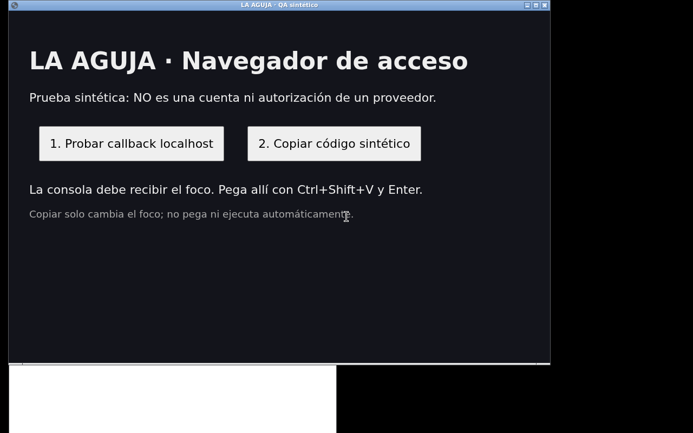

Captura real de una VM UEFI arrancada con Rescue Disk 0.8.0: página y código sintéticos, no una cuenta ni autorización de un proveedor. ① Callback local de prueba. ② Copiar cambia el foco. ③ Ctrl+Shift+V pega explícitamente en la misma consola. El resultado no certifica un login OAuth real.

- Desde la consola local, inicia el flujo oficial del arnés. El asistente reconoce las URLs de autorización permitidas y abre Chromium mínimo como usuario normal, con su sandbox.

- Comprueba el dominio y autentícate tú. No se sustituye la página del proveedor por un formulario que capture tu contraseña.

- Si el proveedor usa retorno `localhost`, la misma instancia del CLI sigue viva y conserva su callback, `state` y PKCE.

- Si requiere copiar un código, usa el botón de copiar del proveedor. La consola gráfica toma el foco al cambiar el propietario de la selección; el asistente no lee su contenido.

- Pega explícitamente con Ctrl + Shift + V en la consola que está esperando. Está unida a la **misma PTY**, no a un segundo login. Comprueba el resultado que muestra el CLI.

- Cerrar navegador o consola gráfica devuelve al terminal original sin matar el CLI. Ctrl + ] permite abrir una URL pendiente capturada o cerrar el asistente activo.

```
# Flujos asistidos oficiales desde consola local
aguja login codex
aguja login claude
aguja login antigravity

# OpenCode utiliza su recorrido nativo; no se promete el asistente para todos sus proveedores
opencode auth login
```

En SSH, serie o una sesión sin pantalla compatible no se abre por magia un navegador local. La URL y el método nativo permanecen disponibles. Si un callback escucha en localhost del live, abrir la URL en tu PC no redirige automáticamente ese puerto: utiliza un método remoto oficial o un reenvío explícito apropiado a ese flujo, entendiendo `state`/PKCE. No inventes códigos, no registres URLs privadas y no desactives TLS para completar una sesión.

No hay QR en el nuevo recorrido. El navegador sirve para autorizar, no para convertir la IA en dueña de tus cuentas. Su perfil es privado y temporal en `/run`, retirado al cerrar; el token resultante que guarda el CLI tiene su propio ciclo de vida. Login real e inferencia de cada proveedor deben comprobarse por separado.

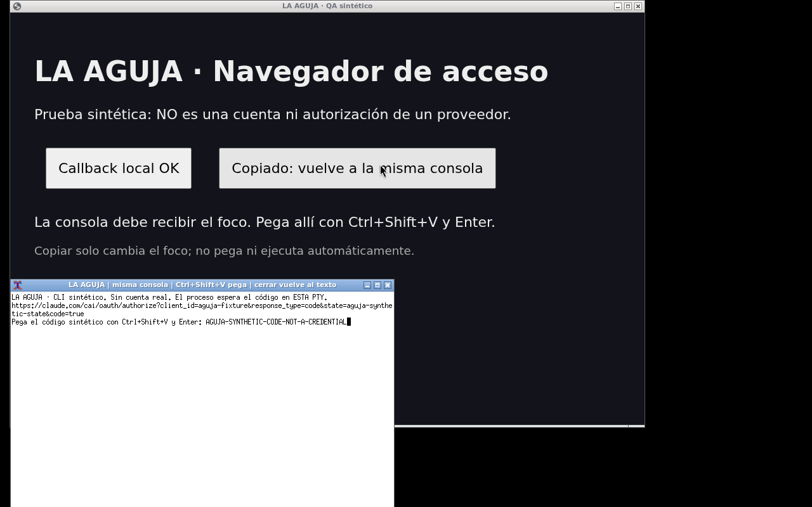

Prueba gráfica en la imagen final: callback local y copia sintéticos, foco en la consola y pegado explícito. «MISMA PTY: OK» comprueba que recibió el código el proceso original. Cerrar la prueba devolvió la consola de texto. No se realizó consentimiento, login ni inferencia en una cuenta de IA.

## Tu primera tarea: entender antes de reparar

Empieza con una pregunta concreta: «¿por qué no arranca este equipo?» o «¿puedo copiar mis documentos?». No con «arregla todo». El resultado útil de una primera sesión puede ser un diagnóstico claro y un plan, incluso sin modificar nada.

- **Comprueba dónde estás.** Ejecuta `aguja status` y lee la guía `aguja context`. Confirma versión, conectividad y que estás en el live correcto.

- **Identifica cada disco.** Consulta el inventario siguiente. Separa USB de rescate, disco interno y destino externo. Tamaño, modelo y serie importan más que la letra `sda`.

- **Describe el síntoma.** Anota el error exacto y qué ocurrió antes: actualización, corte de energía, cambio de firmware, espacio lleno. No conviertas una sospecha en diagnóstico.

- **Decide el siguiente paso con evidencia.** Si hay lecturas fallidas o desconexiones, considera una imagen del original antes de reparar. Si hay cifrado, verifica la disponibilidad de su clave.

- **Deja un resumen entendible.** «Observamos X; falta comprobar Y; proponemos Z; antes de escribir necesitamos copia y destino». Si cambia algo, verifica el efecto real después.

```
# Inventario inicial en el Rescue Disk
aguja status --disks
lsblk -o NAME,SIZE,MODEL,SERIAL,FSTYPE,LABEL,MOUNTPOINTS
findmnt
ip -br addr
aguja tools
```

Estos comandos consultan estado. No montan automáticamente particiones ni reparan el sistema de archivos. Leer un disco muy deteriorado también puede exigir prudencia: no repitas pruebas extensas sin criterio.

### Ejemplo de mensaje para tu agente

Estoy en LA AGUJA y el sistema interno no inicia. Primero identifica USB, disco interno y sus particiones con datos reales. No montes en escritura, no repares y no cambies el arranque todavía. Explica los hallazgos en palabras sencillas, indica qué falta comprobar y propón un plan con destino de respaldo. Antes de cualquier cambio, describe exactamente qué dispositivo tocarías y cómo verificaríamos el resultado.

Este mensaje orienta el trabajo; **no reduce los permisos técnicos del agente**. El operador sigue controlando decisiones y destinos. Nunca pegues la recovery key o una API key en un prompt para «dar contexto».

### Qué ves mientras trabaja alguien por SSH

El panel puede mostrar sesiones y tareas. Selecciona una tarea con ↑/↓ y Enter; según la vista, S filtra sesión, F fallos, B sondeos y L vuelve al directo. El detalle permite revisar comando, resultado y salida filtrada. No es una grabación íntegra del teclado ni un informe permanente.

```
# Etiqueta una consulta remota para reconocerla en el panel
aguja run --label "Inventario inicial" -- lsblk -o NAME,SIZE,MODEL,FSTYPE
```

## Usar un agente: objetivo, evidencia y límites

El agente puede leer salidas, escribir scripts, comparar configuraciones y ejecutar herramientas que ya están en el live. Su valor no es solo «ver una pantalla»: puede encadenar observaciones y ayudarte a justificar una decisión. Su mayor riesgo es poder hacer rápidamente un cambio incorrecto con acceso de administrador.

```
# Primero, orientarse en el live
aguja context
aguja tools
lsblk -o NAME,SIZE,TYPE,FSTYPE,LABEL,MOUNTPOINTS
findmnt

# Ejemplo de un diagnóstico etiquetado en el panel
aguja run --label "Inventario de discos" -- lsblk -o NAME,SIZE,TYPE,FSTYPE,LABEL,MOUNTPOINTS

# Abrir el arnés elegido, después de configurar su autenticación
aguja agent codex
```

Puedes elegir `claude`, `antigravity`, `opencode` o `shell`. El modo completo puede omitir aprobaciones del CLI y `sudo` está disponible: no lo confundas con un modo técnico de observación. No se configura un agente para reparar automáticamente cada máquina sin diagnóstico.

### Un encargo útil y verificable

Quiero identificar por qué el equipo no arranca. Primero muestra discos, montajes y estado del hardware sin repararlos. No montes el disco en escritura, no ejecutes fsck, no cambies particiones ni cargador. Resume evidencia y dudas, propone comandos y confirma conmigo el disco y el respaldo antes de cualquier escritura. No envíes archivos personales ni secretos al proveedor.

Esta petición orienta al modelo; no garantiza obediencia ni aislamiento. Acompáñala de una política externa de permisos, un operador atento y copias verificadas. Si necesitas una restricción forense de escritura, usa barreras técnicas adecuadas fuera del simple prompt.

### La información puede ser hostil

Un README, una página web o la salida de un proceso pueden contener instrucciones maliciosas dirigidas al modelo. Trátalos como datos, no como autorización del propietario. Revisa las órdenes propuestas, no solo la explicación. No entregues dumps, cookies, claves, historiales o archivos de clientes por comodidad. Lo que se envía al proveedor puede salir del equipo y estar sujeto a sus condiciones.

El panel de actividad sirve para observar tareas y comandos redactados durante la sesión; no es un control de acceso, una transcripción forense completa ni una garantía de ocultar un secreto que el agente divulgue. Costes, cuotas, latencia y capacidades dependen del proveedor y de tu cuenta.

## Herramientas de rescate y comandos de orientación

`aguja tools` presenta el inventario disponible del arranque actual. Puede indicar un binario ausente: no sustituyas el estado vivo por esta tabla. Los comandos siguientes son de orientación o lectura; la letra `XXX` es un marcador que debes reemplazar tras identificar el dispositivo.

| Categoría | Herramientas | Uso y límite |
| --- | --- | --- |
| Discos y montajes | lsblk, blkid, findmnt, parted, sgdisk | Identificar estructura; comandos de crear/borrar particiones sí modifican el disco. |
| Hardware | smartctl, nvme, lshw, lspci, lsusb | Inventario y señales de salud. SMART sin errores no prueba que todo el hardware esté sano. |
| Recuperación | ddrescue, ddrescuelog, testdisk, photorec | Imagen con mapa, análisis y recuperación. Destino separado; no garantizan recuperar todos los archivos o nombres. |
| Sistemas de archivos | e2fsck, btrfs, xfs_repair, ntfs-3g | Cada sistema tiene reglas. Reparar o forzar montaje puede escribir; no hay un comando universal seguro. |
| Cifrado y volúmenes | cryptsetup, dislocker, lvm, mdadm | Necesitan claves y topología correctas. Ensamblar/importar mal un RAID puede agravar el problema. |
| Red | nmcli, nmtui, ip, ssh, scp, rsync | Configurar red y transferir. Comprueba destino, permisos y qué datos estás enviando. |
| Instalación/arranque | debootstrap, pacstrap, grub-install, efibootmgr, wimlib-imagex | Capacidad avanzada disponible; modificar firmware, bootloader o instalar exige plan y respaldo. |
| Sesiones y scripts | tmux, zsh, nano, rg, jq, python3 | Continuidad y automatización. No ejecutes scripts desconocidos como root sin revisar. |

```
# En el Rescue Disk, orientar antes de escribir
lsblk -o NAME,SIZE,MODEL,SERIAL,FSTYPE,LABEL,MOUNTPOINTS
findmnt
ip -br addr
ip route
sudo -n smartctl -a /dev/XXX

# Mantener una tarea remota tras reconectar
# No uses el mismo nombre si ya existe una sesión de otra persona
tmux new -s rescate
# Más tarde:
tmux attach -t rescate
```

### Montar para leer no equivale a una garantía forense

`aguja mount-ro` solicita `ro,nosuid,nodev,noexec`. Identifica primero una partición, no el disco completo, y comprueba el montaje. Determinados sistemas pueden necesitar opciones adicionales contra reproducción del journal; no es un bloqueador físico de escritura. No fuerces un Windows hibernado en escritura.

```
# Sustituye la partición tras verificar modelo, serie y lsblk
aguja mount-ro /dev/PARTICION_ORIGEN /mnt/target
findmnt /mnt/target
```

### ddrescue: pensar el destino antes de copiar

El dispositivo origen averiado se lee; la imagen destino se escribe en almacenamiento sano diferente; el mapa permite retomar. Verifica espacio y correspondencia antes de ejecutar. No se da una receta de clonado hacia `/dev/sda` que alguien pueda pegar y destruir su disco. Obtén primero `ddrescue --help` y un plan específico con origen, destino y mapa.

## Qué puedes lograr: diez recorridos concretos

Los ejemplos siguientes son **procedimientos que puedes adaptar**, no historias inventadas de clientes recuperados ni promesas de éxito. La IA ayuda a leer evidencias y ordenar pasos; el operador verifica que corresponden a la máquina real.

CASO 01 · LECTURA

### El sistema no inicia y necesitas documentos

Arranca el USB, identifica la partición, comprueba si está cifrada y monta en lectura con las opciones apropiadas. Copia a otro destino autorizado y verifica archivos. El agente puede sugerir rutas y excluir contenido innecesario.

**No promete:** descifrar sin clave, superar un SSD averiado ni preservar todas las fechas/ACL sin elegir un método adecuado.

CASO 02 · DIAGNÓSTICO

### Dudas entre disco, arranque y hardware

Reúne estructura de discos, estado SMART/NVMe y configuración de arranque. Separa síntoma de causa. Un informe puede justificar hacer una imagen antes de reparar.

**No promete:** atribuir un fallo de E/S a daño físico sin evidencias. Una VM puede fallar por almacenamiento virtual o su host.

CASO 03 · SOPORTE AUTORIZADO

### El técnico está lejos

El propietario prepara la tailnet, arranca y entrega la IP actual. Un equipo autorizado conecta por SSH con su clave. El operador observa tareas y revoca el nodo al terminar.

**No promete:** entrar sin autorización, Internet o política compatible; no instala Tailscale en el sistema interno por hacerlo en el live.

CASO 04 · BITLOCKER

### Necesitas leer un Windows cifrado

Obtén del propietario la recovery key válida. En Windows, el Imager puede consultar/exportar una clave disponible con los permisos necesarios e incluirla si se solicita. En el live, comprueba volumen y herramienta antes de desbloquear.

**No promete:** recuperar una clave inexistente, eludir TPM/cifrado ni resolver corrupción. Suspender BitLocker es una acción separada sobre Windows y no es necesario para cualquier lectura.

CASO 05 · CAMBIO CONTROLADO

### Reparar cargador o sistema de archivos

Primero evidencia, copia verificable y destino confirmado. Después un procedimiento específico al sistema BIOS/UEFI y filesystem. Guarda el antes/después y prueba arranque sin el USB.

**No promete:** un comando universal `fsck -y` o reinstalación de GRUB correcta en todas las máquinas. Escribir sobre el original puede impedir otra recuperación.

CASO 06 · AUTOMATIZACIÓN

### Inventariar una flota de equipos

Una política de claves/nodos y scripts revisados pueden recopilar inventarios y diagnósticos al arrancar. Separa recogida permitida de reparación. Una IA puede comparar los informes después de redactar datos sensibles.

**No promete:** gestión de flota SaaS ya implementada, políticas multiusuario completas ni reparación autónoma segura de todo hardware.

### De la idea al procedimiento: ejemplos para practicar

### 1. Rescatar documentos de un sistema que no arranca

**Por qué sirve:** el live no necesita que el Windows/Linux interno inicie. **Necesitas:** disco legible, claves si está cifrado y destino sano distinto del origen.

- Identifica disco, partición y cifrado; no confundas el USB con el disco interno.

- Si hay señales de deterioro, decide primero si crear una imagen.

- Abre la partición con un montaje de lectura adecuado a su filesystem y confirma con `findmnt`.

- Copia solo las carpetas autorizadas al destino separado; revisa espacio y método para conservar metadata cuando sea necesaria.

- Abre archivos representativos desde la copia y coteja integridad cuando corresponda. No declares recuperación solo porque una carpeta tiene nombres.

**Resultado comprobable:** documentos utilizables fuera del disco original. No repara necesariamente el arranque.

### 2. Diagnosticar si falla el disco, la red o el arranque

**Por qué sirve:** tienes un sistema independiente para comparar el síntoma. Recoge inventario, montajes y señales de salud apropiadas al dispositivo; en una VM, incluye el almacenamiento del host. Consulta DNS, rutas y hora si falla HTTPS.

**Resultado comprobable:** hipótesis sustentadas y siguientes pruebas, no «hardware sano» solo por ver SMART sin alertas. Evita pruebas largas sobre un disco que se desconecta.

### 3. Recibir ayuda de un técnico que está en otra ciudad

- Prepara SSH y una tailnet propia antes de la visita si habrá Internet.

- Arranca, desbloquea y confirma que el nodo de este arranque fue autorizado.

- El técnico entra desde su equipo autorizado con la IP actual y compara huella.

- Observa las tareas, confirma los cambios previstos y guarda un resumen.

- Al terminar, cierra la sesión y administra nodo/clave temporal en el control plane.

**Lo sorprendente:** el sistema instalado puede seguir averiado mientras la consola del live es accesible. No hace falta abrir por este recorrido un puerto público del router.

### 4. Leer un volumen BitLocker con su clave legítima

Obtén la clave por el canal autorizado; identifica el volumen y verifica compatibilidad de la herramienta. Si preparas desde Windows y su clave está disponible, puedes incluirla explícitamente en una cápsula cifrada. Desbloquea y monta según el procedimiento específico; verifica los datos copiados.

**Resultado comprobable:** acceso autorizado a un volumen compatible. No se rompe BitLocker ni se promete salvar un volumen corrupto.

### 5. Recuperar archivos borrados trabajando sobre una copia

Evita seguir escribiendo en el origen. Valora una imagen y trabaja sobre ella con TestDisk/PhotoRec u otra herramienta apropiada; el destino de lo recuperado debe ser otro almacenamiento. Valida contenido, no solo extensión.

**Resultado comprobable:** archivos recuperados que realmente abren. TRIM, sobrescritura, cifrado y daño físico pueden impedir la recuperación; nombres/carpetas originales no siempre sobreviven.

### 6. Reparar un arranque después de una actualización

Comprueba BIOS/UEFI, esquema de particiones, ESP y sistema instalado. Conserva evidencias/copia y elige un procedimiento específico del sistema. Solo entonces modifica el cargador o su configuración. Para Windows pueden ser necesarias herramientas de recuperación del fabricante.

**Resultado comprobable:** el sistema interno arranca sin el USB y sus datos permanecen accesibles. Instalar GRUB sin error no demuestra eso.

### 7. Crear una imagen de un disco con errores y retomar después

Con almacenamiento sano suficiente, ddrescue puede copiar a una imagen y usar un archivo de mapa para retomar. Primero confirma origen, imagen destino y mapa; consulta su ayuda/manual y adapta los intentos al estado real. Trabaja después sobre la copia.

**Resultado comprobable:** mapa conservado, zonas leídas/faltantes identificadas y una copia de trabajo. No garantiza leer sectores físicamente perdidos.

### 8. Preparar una migración o instalación sin improvisar

Inventaría hardware, exporta datos autorizados y claves de recuperación, elige distribución/licencia e imagen oficial y prepara un segundo USB instalador si corresponde. Conserva intacto el de rescate. Usa el instalador apropiado; una ISO Windows no se vuelve arrancable por cualquier copia cruda.

**Resultado comprobable:** respaldo recuperable y medio de instalación correcto. LA AGUJA no incluye Windows, WinPE ni licencias, ni un asistente universal de instalación.

### 9. Repetir tu configuración sin volver a escribir todo

Guarda una plantilla `.aguja` cifrada y ábrela en el Imager cuando prepares otro medio. Actualiza claves, red y sesiones, escoge la imagen y verifica el nuevo USB. No traslada automáticamente una sesión caducada ni la identidad RAM de una tailnet.

**Resultado comprobable:** configuración coherente y revisada, con menos errores de escritura. No es gestión de flota ya implementada.

### 10. Convertir un diagnóstico técnico en una explicación entendible

Un agente puede ordenar salidas permitidas, distinguir hallazgos de hipótesis, escribir una lista de próximos pasos y generar un informe adaptado al propietario. El técnico coteja cada afirmación con resultados reales y elimina datos sensibles antes de compartir.

**Resultado comprobable:** informe con evidencia, cambios, límites y verificación. Una explicación convincente no demuestra por sí sola que la reparación funcionó.

## Ruta profesional: control, evidencia y repetibilidad

LA AGUJA también sirve como entorno de trabajo técnico. Su valor es facilitar una entrada independiente y automatizable al equipo; el procedimiento, la custodia de datos y la comprobación final siguen siendo tuyos.

- **Delimita la intervención.** Propietario, síntoma, equipos, datos autorizados y resultado esperado. Separa diagnóstico de escritura.

- **Registra la línea base.** Versión de imagen, identidad del USB y origen/destino, modo de arranque, montajes, red y estado relevante. No incluyas secretos en inventarios.

- **Elige la estrategia.** Lectura directa si procede; imagen/copia antes de reparaciones cuando haya degradación o necesidad de preservar el original. No escanees una y otra vez un medio inestable.

- **Mantén la sesión.** Usa `tmux` para tareas remotas y `aguja run --label` para identificarlas. La sesión mantiene procesos en ese live; no sobrevive al apagado por usar tmux.

- **Ejecuta cambios acotados.** Identifica dispositivo por modelo/serie y topología actual. No reutilices `/dev/sdX` de una sesión anterior. Comprueba si el filesystem está montado antes de repararlo.

- **Verifica el resultado observable.** Copia de archivos abre; conexión externa funciona; sistema interno arranca; servicio responde. El exit code se registra, pero no sustituye esas verificaciones.

- **Entrega y cierra.** Informe breve, copia validada, tareas pendientes, rollback y retirada de accesos temporales. El panel de actividad en RAM no sustituye ese informe.

### Contexto y estado para automatización

```
# En el Rescue Disk; consulta de contratos del propio producto
aguja context
aguja status --json
aguja profile status --json
aguja tailscale status --json
aguja activity --json
aguja doctor --json
```

Un consumidor de JSON debe comprobar código de salida y campos reales de esa versión. Un estado healthy del live no equivale a filesystem interno sano ni a sesión IA vigente. Revisa/redacta los informes antes de guardarlos o enviarlos.

### ¿Puedo usar un agente desde fuera?

Sí: un técnico o agente con cliente SSH y credenciales autorizadas puede entrar por LAN o tailnet. Empieza leyendo `aguja context` y el estado actual; no necesitas instalar OpenClaw en el pendrive para que un controlador externo trabaje por SSH. Un agente local se inicia con `aguja agent codex`, `aguja agent claude`, `aguja agent antigravity` o `aguja agent opencode` tras preparar su autenticación.

Esta versión no incluye relay, túneles propios ni el conector MCP propietario. Usa las herramientas SSH de tu elección en tu LAN o tailnet.

### Permisos, modo ask y persistencia

El modo de agente `full` habilita mecanismos de acceso amplio del arnés. La configuración avanzada `agent_mode=ask` conserva las aprobaciones propias del arnés; no quita el sudo del propietario ni convierte el sistema en sandbox. Comprueba el modo efectivo antes de trabajar.

`persistent_home=no` mantiene HOME temporal; `persistent_home=yes` puede conservar HOME y tokens en el USB **sin cifrar**. La cápsula cifrada no cifra ese HOME ni los informes de AGUJA_DATA. La identidad de tailnet permanece RAM incluso si conservas otros datos. Define estas decisiones por intervención, no por comodidad accidental.

### Mini plantilla de entrega

Objetivo y equipo: …
Versión y dispositivos comprobados: …
Evidencia antes: …
Copia y reversión disponibles: …
Cambios autorizados realizados: …
Verificación real después: …
Datos recuperados y límites: …
Accesos temporales retirados / pendientes: …

## Si algo falla: separar las capas

| Síntoma | Primera comprobación | Siguiente acción segura |
| --- | --- | --- |
| No hay IP | ip -br addr, aguja network. | Revisar cable/SSID, DHCP y controlador. aguja wifi permite configurar Wi-Fi localmente. |
| Imagen «no admite Tailscale» | Versión y tailscale-profile-v1. | Usar imagen compatible; no editar un marcador para fingir que contiene el servicio. |
| Perfil bloqueado | Estado local y contraseña correcta. | aguja profile unlock. Si olvidaste la frase, volver a preparar con datos válidos; no se promete recuperarla. |
| Alta rechazada/caducada | aguja tailscale status --json; control plane. | Revisar clave, vigencia, tipo de un uso, DNS, TLS y hora; no mostrar la clave en logs. |
| Nodo esperando aprobación | Consola Tailscale/Headscale y nodo de este arranque. | Que el administrador autorice según política. No llamar «conectado» solo porque apareció una IP antigua. |
| SSH tarda hasta timeout | Misma tailnet, IP actual y ACL del puerto. | Separar ruta/control plane de OpenSSH; revisar política sin abrir todo el acceso para probar. |
| SSH responde pero rechaza autenticación | Usuario aguja, clave/contraseña y modo SSH. | Revisar OpenSSH frente a Tailscale SSH; una auth key no es una contraseña SSH. |
| Huella SSH distinta | Huella local, identidad del USB y regrabación. | Confirmar el motivo antes de actualizar known_hosts; no desactivar comprobación. |
| No abre navegador | Consola local gráfica, herramientas y URL permitida. | Usar flujo nativo/URL original. SSH/serie no ofrecen el mismo navegador; Ctrl+] abre una URL pendiente local. |
| Copié pero el CLI espera | Foco de la consola gráfica de esa PTY. | Pegar explícitamente con Ctrl+Shift+V. Copiar no entrega el código automáticamente. |
| Callback OAuth ocupado/falla | Error del CLI y puerto localhost solicitado. | Resolver conflicto o reiniciar el flujo oficial; no reutilizar URLs/code/state antiguos. |
| USB no elegible o ocupado | Unidad extraíble, identidad y montajes. | Revisar destino y cerrar uso del USB. No seleccionar un disco interno como atajo. |
| Respaldo Windows no disponible | Función no implementada. | Respaldar antes con herramienta externa; no se inició una escritura por rechazar esa opción. |
| Windows/VM registra HTTPS o E/S intermitente | Red del invitado, almacenamiento virtual y eventos. | Diagnosticar la VM por separado. 0xC0000006 observado en pruebas anteriores no certifica un disco físico dañado ni una solución automática. |

Si compartes un informe, retira IPs privadas identificables, nombres de clientes y cualquier token. `aguja doctor --json` y los estados públicos están diseñados para no incluir claves, pero revisa el contenido antes de enviarlo.

### Preguntas frecuentes, sin dar nada por sabido

### ¿Tengo que saber Linux para usarla?

No para preparar el USB y recorrer el inventario inicial. Reparar particiones, cifrado o arranque sí puede requerir criterio técnico. Empieza por la ruta guiada y pide ayuda para tareas que no puedas validar.

### ¿Necesito pagar cuatro servicios de IA?

No necesitas autenticar los cuatro, y puedes usar herramientas locales sin IA. Si eliges un proveedor, sus cuentas, planes, cuotas y términos son independientes de LA AGUJA. La app no incluye créditos ni una suscripción a todos ellos.

### ¿Funciona sin Internet?

Puede arrancar, inventariar y usar herramientas locales. Descargar, autorizar o consultar IA en nube y registrar una tailnet necesitan conectividad. Haber importado una sesión no convierte un modelo en nube en modelo offline.

### ¿Me borra Windows al arrancar?

No instala, repara ni monta automáticamente el disco interno al inicio. La grabación del Imager sí borra el USB confirmado; comandos de reparación/instalación posteriores pueden modificar el disco interno cuando se ejecutan.

### ¿La contraseña del USB desbloquea BitLocker?

No. La frase de la cápsula protege sus datos; contraseña SSH permite entrar al live; recovery key BitLocker desbloquea el volumen correspondiente. No son intercambiables.

### ¿Por qué no aparece mi USB?

El recorrido exige un dispositivo elegible y desmontado. Confirma conexión, identidad y si otra app lo está usando; revisa el mensaje exacto. No elijas un disco interno ni fuerces filtros para continuar.

### ¿Puedo usarla en cualquier Mac o placa ARM?

La imagen actual es x86-64; no se promete Apple Silicon, ARM, cualquier firmware o todos los controladores. Verifica arquitectura, arranque y política del equipo.

### ¿Por qué el soporte remoto falla en el segundo arranque?

La identidad tailnet es temporal. Una clave de un uso puede haber quedado consumida, otra caducada o el nuevo nodo pendiente de aprobación. Comprueba el registro de este arranque y su IP actual.

### ¿Puedo quitar el USB cuando aparece el panel?

No lo retires como método habitual: puede contener configuración, workspace o datos en uso. Cierra tareas, verifica montajes, sincroniza y apaga coordinadamente antes de retirarlo.

## Cerrar una tarea sin dejar accesos olvidados

- Resume qué se observó, qué cambió y qué se comprobó. Un código de salida 0 no equivale a que el sistema interno arranque ni a que todos los archivos sean recuperables.

- Copia los informes autorizados a un destino externo y verifica que estén completos. La raíz RAM se perderá; AGUJA_DATA no está cifrada por el simple hecho de cifrar la cápsula.

- Cierra sesiones IA y retira permisos temporales según la política de su propietario. No borres a ciegas autenticaciones compartidas.

- Cierra la asistencia SSH; retira el nodo de este arranque del control plane y revoca la clave de alta cuando ya no se necesite. Actualiza el USB si iba a usarse con otra finalidad.

- Verifica montajes y procesos en uso, sincroniza y apaga coordinadamente. No retires un USB mientras escribe ni cortes energía a un disco que todavía guarda cambios.

- Prueba el resultado en el sistema interno cuando corresponda; conserva evidencia y rollback hasta que el propietario lo acepte.

```
# Inspección final antes de desmontar/apagar de forma coordinada
findmnt
sync
# El apagado termina todas las sesiones; ejecútalo solo al cerrar la tarea
sudo -n systemctl poweroff
```

## Qué está comprobado y qué no debes deducir

La edición pública 0.9.0 elimina las cuentas de LA AGUJA y el relay propio. Las cinco capturas de configuración Linux y la de herramientas IA se tomaron del paquete Linux real 0.9.0 con datos sintéticos y estado aislado. La captura de imagen preparada y las tres capturas del live conservan evidencia histórica de 0.8.0; BitLocker conserva su prueba Windows 0.8.1. La candidata pública pasó pruebas del runtime, Electron, siete idiomas, web anónima y arranque UEFI con SSH/root; eso no acredita grabación física de USB ni login/inferencia de proveedores en esta versión.

La entrega 0.8.1 comprobó BitLocker nativo con UAC sin leer claves ni cambiar protección, cuatro terminales Linux con entrada sintética y preparación/lectura de perfiles normales y cifrados. 0.8.2 cambió el titular en siete idiomas; no repitió instalación nativa Windows. Las pruebas previas del Rescue Disk incluyen ocho arranques KVM (BIOS/UEFI × perfil en claro/cifrado), bloqueo/desbloqueo y registro con OpenSSH en un Headscale aislado. Estas son evidencias de los recorridos ensayados, no certificación universal del hardware ni éxito de rescates de clientes.

| Comprobación | Lo que demuestra | Lo que no demuestra |
| --- | --- | --- |
| Validación de esquema/secretos | Opciones y campos admitidos, rechazo de entradas inseguras, datos privados fuera del recibo. | Una cuenta válida, una auth key vigente o la obediencia del agente. |
| Imagen FAT y lector runtime | El perfil se escribe, se lee y conserva la configuración; la fuente no se altera. | Arranque universal, escritura física de cada marca de USB o soporte de todos los controladores. |
| UI Electron | Recorrido, controles, secretos ocultos e aislamiento del renderer. | Proveedor real autorizado ni recuperación exitosa de un cliente. |
| Flujo OAuth sintético | Ventanas, PTY, copiar/foco/pegado y devolución a consola según la prueba. | Login real de cada proveedor, facturación o inferencia real. |
| Entorno de pruebas de red | La configuración y el proceso de alta pueden verificarse sin usar una tailnet personal. | Que tu organización permita ese nodo o esa conexión concreta. |

El comportamiento de firmware, hardware, red, ACL, servicios IA y cuotas debe verificarse en tu entorno. No publicamos como casos reales rescates que no se han realizado. El producto sigue experimental y el acceso de la web permanece privado; futuras funciones para más usuarios se distinguen de lo disponible hoy.

## Referencias y lectura siguiente

Este manual describe la candidata pública 0.9.0 y distingue la evidencia de versiones anteriores. Para políticas o herramientas externas, consulta la documentación del fabricante de la versión que uses:

- [Tailscale CLI](https://tailscale.com/docs/reference/tailscale-cli) · estados y opciones del cliente.

- [Tailscale SSH](https://tailscale.com/docs/features/tailscale-ssh) · diferencia respecto a OpenSSH y políticas.

- [Headscale · primeros pasos](https://headscale.net/stable/usage/getting-started/) · alta con claves de administrador.

- [GNU ddrescue](https://www.gnu.org/software/ddrescue/manual/ddrescue_manual.html) · lectura, mapa y estrategias de recuperación.

- [TestDisk](https://www.cgsecurity.org/wiki/TestDisk) · alcance de la herramienta y recuperación.

- [Manual OpenSSH](https://man.openbsd.org/ssh) · conexión, claves y reenvíos explícitos.

- [Microsoft · recuperación de BitLocker](https://learn.microsoft.com/windows/security/operating-system-security/data-protection/bitlocker/recovery-overview) · claves y procedimientos del propietario.

[Obtener Flash Imager](https://aguja.transcendenceia.net/#application) · [Código y releases](https://github.com/Transcendenceia/La-Aguja) · [Privacidad](https://aguja.transcendenceia.net/privacy)
